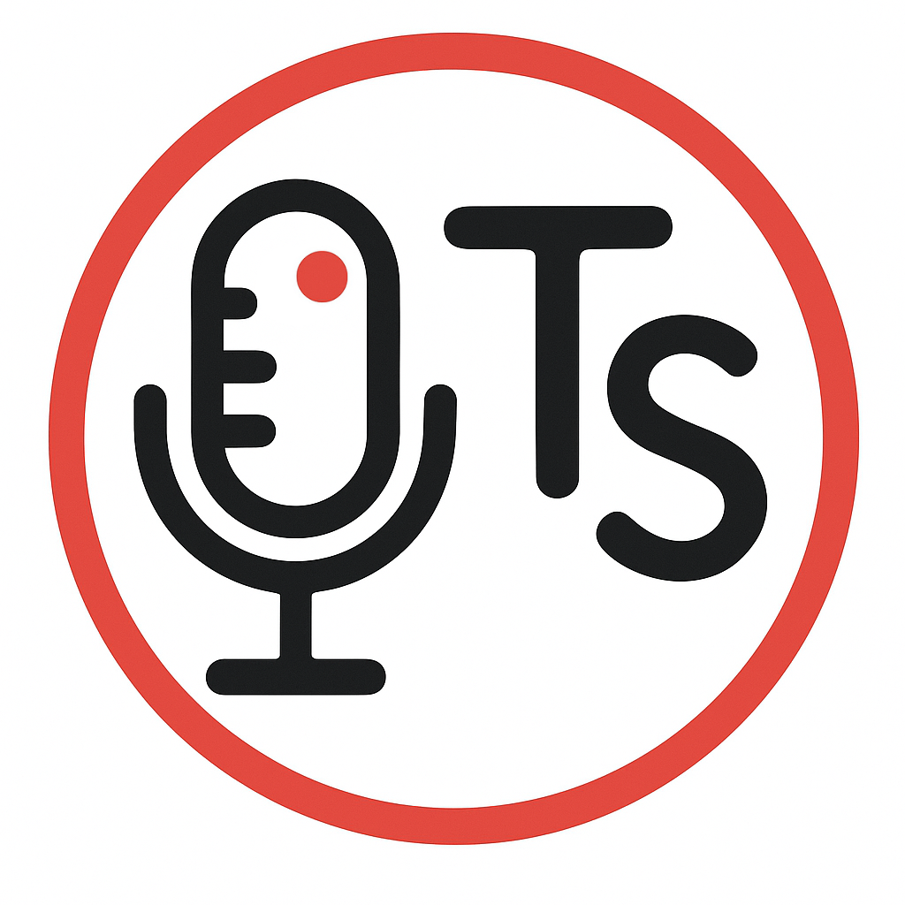

# TranscriptionSuite



<pre>A comprehensive Speech-to-Text Transcription Suite with Docker-first
architecture. Written in Python, utilizing faster_whisper with
CUDA 12.8 acceleration.
</pre>

## Features

- **Multilingual**: Supports [90+ languages](https://whisper-api.com/docs/languages/)
- **GPU Accelerated**: CUDA 12.6 with NVIDIA GPU support
- **Long-form Dictation**: Real-time transcription with optional live preview
- **File Transcription**: Transcribe audio/video files
- **Speaker Diarization**: PyAnnote-based speaker identification
- **Audio Notebook**: Calendar-based audio notes with full-text search, LLM chat via LM Studio integration
- **Remote Access**: Secure access via Tailscale from anywhere
- **Cross-Platform Clients**: Native system tray apps for KDE, GNOME, and Windows

📌 *Half an hour of audio transcribed in under a minute (RTX 3060)!*

---

## Quick Start

### Prerequisites

- Docker
- NVIDIA GPU with CUDA support (recommended)
- If you want GPU acceleration inside Docker:
  - Linux: Install [NVIDIA Container Toolkit](https://docs.nvidia.com/datacenter/cloud-native/container-toolkit/install-guide.html)
  - Windows: Use Docker Desktop with the WSL2 backend and install the NVIDIA GPU driver with WSL support.

Verify GPU support:

```bash
docker run --rm --gpus all nvidia/cuda:12.6.0-base-ubuntu22.04 nvidia-smi
```

### Installation

```bash
# Clone the repository
git clone https://github.com/homelab-00/TranscriptionSuite.git
cd TranscriptionSuite/docker

# Build the Docker image
docker compose build

# Run first-time setup (interactive)
docker compose run --rm transcription-suite --setup

# Start the server
docker compose up -d
```

The server is now running at **[http://localhost:8000](http://localhost:8000)**

### First-Run Setup

The setup wizard will ask for:

| Setting | Description | Required |
|---------|-------------|----------|
| **HuggingFace Token** | For speaker diarization models | Yes (for diarization) |
| **Admin Token** | Server authentication | Auto-generated if not provided |
| **LM Studio URL** | For AI chat features | Optional |

Get your HuggingFace token at [huggingface.co/settings/tokens](https://huggingface.co/settings/tokens)

If you run `docker compose up -d` without a TTY (default), the container will automatically generate the minimum required configuration on first run (including an `ADMIN_TOKEN`) and persist it to the Docker volume under `/data/config/secrets.json`.

### Alternative: Skip Interactive Setup

Provide environment variables instead:

```bash
ADMIN_TOKEN=your-secret-token \
HUGGINGFACE_TOKEN=hf_xxx \
docker compose up -d
```

Or create a `.env` file in the `docker/` folder:

```bash
HF_TOKEN=hf_your_token_here
ADMIN_TOKEN=your_secret_token
LOG_LEVEL=INFO
```

To view the generated config inside the running container:

```bash
docker compose exec transcription-suite cat /data/config/secrets.json
```

---

## Native Client

The Native Client is a lightweight tray application for recording audio and sending it to the server for transcription.
It does not require Docker or NVIDIA Container Toolkit.

### Download

| Platform | Download | Notes |
|----------|----------|-------|
| **KDE Plasma** | `TranscriptionSuite-KDE-x86_64.AppImage` | Standalone |
| **GNOME** | `TranscriptionSuite-GNOME-x86_64.AppImage` | Requires system GTK3 |
| **Windows** | `TranscriptionSuite.exe` | Standalone |

### Usage

1. Run the AppImage or executable
2. The tray icon appears in your system tray
3. **Left-click** to start recording
4. **Middle-click** to stop and transcribe
5. Result is automatically copied to clipboard

### Tray Icon Colors

| Color | State |
|-------|-------|
| Grey | Disconnected |
| Green | Ready |
| Yellow | Recording |
| Blue | Uploading |
| Orange | Transcribing |
| Red | Error |

---

## Configuration

### Server Configuration

The server stores configuration in the Docker volume at `/data/config/`. On first run, the setup wizard creates this automatically.

To reconfigure:

```bash
docker compose run --rm transcription-suite --setup
```

### Client Configuration

The client stores settings in `~/.config/TranscriptionSuite/client.yaml`:

```yaml
server:
  host: localhost
  port: 8000
  use_https: false

recording:
  sample_rate: 16000
  device_index: null  # null = default microphone

clipboard:
  auto_copy: true
```

---

## Remote Access (Tailscale + HTTPS)

Access the server securely from other devices on your Tailscale network.

### 1. Set up Tailscale

1. Install Tailscale on your host: [tailscale.com/download](https://tailscale.com/download)
2. Authenticate: `tailscale up`
3. Note your Tailscale hostname (e.g., `my-desktop.tail1234.ts.net`)

### 2. Generate and store certificates

```bash
tailscale cert your-machine.tailnet-name.ts.net
```

Move and rename the generated files to a standard location:

| Platform | Directory | Files |
|----------|-----------|-------|
| **Linux** | `~/.config/Tailscale/` | `my-machine.crt`, `my-machine.key` |
| **Windows** | `Documents\Tailscale\` | `my-machine.crt`, `my-machine.key` |

**Linux:**

```bash
mkdir -p ~/.config/Tailscale
mv your-machine.tailnet-name.ts.net.crt ~/.config/Tailscale/my-machine.crt
mv your-machine.tailnet-name.ts.net.key ~/.config/Tailscale/my-machine.key
chmod 600 ~/.config/Tailscale/my-machine.key
```

**Windows (PowerShell):**

```powershell
mkdir "$env:USERPROFILE\Documents\Tailscale" -Force
mv your-machine.tailnet-name.ts.net.crt "$env:USERPROFILE\Documents\Tailscale\my-machine.crt"
mv your-machine.tailnet-name.ts.net.key "$env:USERPROFILE\Documents\Tailscale\my-machine.key"
```

### 3. Start with TLS enabled

**Linux:**

```bash
TLS_ENABLED=true \
TLS_CERT_PATH=~/.config/Tailscale/my-machine.crt \
TLS_KEY_PATH=~/.config/Tailscale/my-machine.key \
docker compose up -d
```

**Windows (PowerShell):**

```powershell
$env:TLS_ENABLED="true"
$env:TLS_CERT_PATH="$env:USERPROFILE\Documents\Tailscale\my-machine.crt"
$env:TLS_KEY_PATH="$env:USERPROFILE\Documents\Tailscale\my-machine.key"
docker compose up -d
```

### Switch back to local mode

```bash
docker compose stop
docker compose start  # TLS disabled by default
```

---

## Web Interface

Open [http://localhost:8000](http://localhost:8000) to access the Audio Notebook web interface.

**Features:**

- Calendar view of recordings
- Full-text search across all transcriptions
- Audio playback with click-to-seek timestamps
- AI chat about recordings (requires LM Studio)
- Import external audio files

---

## License

MIT License — See [LICENSE](LICENSE).

## Acknowledgments

- [RealtimeSTT](https://github.com/KoljaB/RealtimeSTT)
- [Faster Whisper](https://github.com/SYSTRAN/faster-whisper)
- [OpenAI Whisper](https://github.com/openai/whisper)
- [CTranslate2](https://github.com/OpenNMT/CTranslate2)
- [PyAnnote Audio](https://github.com/pyannote/pyannote-audio)
- [Tailscale](https://tailscale.com/)
