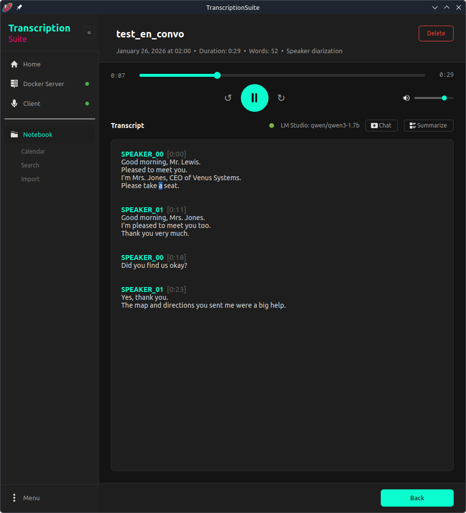

<p align="left">
  
</p>

<table width="100%">
  <tr>
    <td valign="top">
      <table>
        <tr>
          <td width="375px">
<pre>
A fully local and private Speech-To-Text
app with cross-platform support, speaker
diarization, Audio Notebook mode,
LM Studio integration, and both longform
and live transcription. Electron
dashboard + Python backend powered by
faster-whisper with NVIDIA GPU
acceleration or CPU mode. The server
is Dockerized for fast setup.
</pre>
          </td>
        </tr>
      </table>
    </td>
    <td align="left" valign="top" width="280px">
      <br>
      <strong>OS Support:</strong><br>
      
      
      <br><br>
      <strong>Hardware Acceleration:</strong><br>
      <br>
      
    </td>
  </tr>
</table>

---

## Table of Contents

- [1. Features](#1-features)
- [2. Prerequisites](#2-prerequisites)
  - [2.1 Docker](#21-docker)
  - [2.2 Git](#22-git)
- [3. Installation](#3-installation)
  - [3.1 Verify Download (Kleopatra)](#31-verify-download-kleopatra)
- [4. First time setup](#4-first-time-setup)
  - [4.1 Starting the Server & Client](#41-starting-the-server--client)
- [5. Usage](#5-usage)
  - [5.1 Quick Start](#51-quick-start)
  - [5.2 Dashboard Views](#52-dashboard-views)
- [6. Remote Access](#6-remote-access)
  - [6.1 Step 1: Set Up Tailscale](#61-step-1-set-up-tailscale)
  - [6.2 Step 2: Generate Certificates](#62-step-2-generate-certificates)
- [7. Web Interface](#7-web-interface)
- [8. Database & Backups](#8-database--backups)
- [9. Troubleshooting](#9-troubleshooting)
  - [9.1 Server Won't Start](#91-server-wont-start)
  - [9.2 GPU Not Detected](#92-gpu-not-detected)
  - [9.3 Connection Issues (Remote Mode)](#93-connection-issues-remote-mode)
- [10. License](#10-license)
- [11. Acknowledgments](#11-acknowledgments)

---

## 1. Features

- **100% Local**: *Everything* runs on your own computer, the app doesn't need internet
  beyond the initial setup
- **Truly Multilingual**: Supports [90+ languages](https://github.com/openai/whisper/blob/main/whisper/tokenizer.py)
- **Fully featured GUI**: Electron desktop app for Linux, Windows, and macOS (Apple Silicon)
- **GPU + CPU Mode**: NVIDIA CUDA acceleration (recommended), or CPU-only mode for any platform including macOS
- **Longform Transcription**: Record as long as you want and have it transcribed in seconds
- **Live Mode**: Real-time sentence-by-sentence transcription for continuous dictation workflows
- **Speaker Diarization**: PyAnnote-based speaker identification
- **Static File Transcription**: Transcribe an existing audio/video file
- **Remote Access**: Securely access your desktop at home running the model from anywhere
  (utilizing Tailscale)
- **Audio Notebook**: An Audio Notebook mode, with a calendar-based view,
  full-text search, and LM Studio integration (chat about your notes with the AI)

📌*Half an hour of audio transcribed in under a minute (RTX 3060)!*

<div align="center">

#### Screenshots

<table>
  <tr>
    <td></td>
    <td></td>
  </tr>
  <tr>
    <td></td>
    <td></td>
  </tr>
  <tr>
    <td></td>
    <td></td>
  </tr>
</table>

</div>


<div align="center">

#### Video Demo

https://github.com/user-attachments/assets/ea801ae2-d263-493b-a6c5-d431b59601ee

</div>

---

## 2. Prerequisites

### 2.1 Docker

**Linux:**

1. Install Docker Engine
    * For Arch run `sudo pacman -S --needed docker`
    * For other distros refer to the [Docker documentation](https://docs.docker.com/engine/install/)
2. Install NVIDIA Container Toolkit (for GPU mode)
    * Refer to the [NVIDIA documentation](https://docs.nvidia.com/datacenter/cloud-native/container-toolkit/install-guide.html)
    * Not required if using CPU mode

**Windows:**
1. Install [Docker Desktop](https://www.docker.com/products/docker-desktop/) with WSL2 backend (during installation make sure the
  *'Use WSL 2 instead of Hyper-V'* checkbox is enabled)
2. Install NVIDIA GPU driver with WSL support (standard NVIDIA gaming drivers work fine)
    * Not required if using CPU mode

**macOS (Apple Silicon):**
1. Install [Docker Desktop for Mac](https://www.docker.com/products/docker-desktop/)
2. GPU mode is not available on macOS — the server runs in CPU mode automatically

### 2.2 Git

**Linux:**

* For Arch run `sudo pacman -S --needed git`
* For Ubuntu/Debian run `sudo apt install git`
* For other distros refer to the [Git documentation](https://git-scm.com/install/linux)

**Windows:**
* Download and install [Git for Windows](https://git-scm.com/download/win)

**macOS:**
* Git is included with Xcode Command Line Tools: `xcode-select --install`

---

## 3. Installation

Download the Dashboard for your platform from the [Releases](https://github.com/homelab-00/TranscriptionSuite/releases) page:

| Platform | Download | Notes |
|----------|----------|-------|
| **Linux** | `TranscriptionSuite-x86_64.AppImage` | Standalone, no dependencies |
| **Windows** | `TranscriptionSuite Setup.exe` | Standalone installer |
| **macOS** | `TranscriptionSuite-arm64.dmg` | Unsigned build for Apple Silicon |

>* *Linux and Windows builds are x64; macOS is arm64 (Apple Silicon)*
>* *Each release artifact includes an armored detached signature (`.asc`)*

### 3.1 Verify Download (Kleopatra)

1. Download both files from the same release:
   - installer/app (`.AppImage`, `.exe`, `.dmg`, or `.zip`)
   - matching signature file (`.asc`)
2. Install Kleopatra: https://apps.kde.org/kleopatra/
3. Import the public key in Kleopatra from this repository:
   - [`build/assets/homelab-00_0xBFE4CC5D72020691_public.asc`](./build/assets/homelab-00_0xBFE4CC5D72020691_public.asc)
4. In Kleopatra, use `File` -> `Decrypt/Verify Files...` and select the downloaded `.asc` signature.
5. If prompted, select the corresponding downloaded app file. Verification should report a valid signature.

---

## 4. First time setup

**Before starting either Client or Server, you need to configure a few settings.**

To access settings, click the Settings button in the sidebar (gear icon). The Settings
modal has four tabs: `App`, `Client`, `Server`, and `Notebook`.

* **App tab**: General application settings (notifications, auto-copy, etc.)
* **Server tab**: Opens  the full `config.yaml` for advanced server parameters.
  Refer to [README_DEV.md](README_DEV.md) for more information.
* **Notebook tab**: Database backup and restore functionality:
  - Create manual backups of your Audio Notebook database
  - View list of available backups with timestamps and sizes
  - Restore from any backup (creates safety backup first)
* **Client tab**: Configure connection mode:
  * **Local**: Use default settings (localhost:8000)
  * **Remote**: See [Section 6: Remote Access](#6-remote-access) to set up Tailscale first.
    Then configure:
    - Enter your Tailscale hostname in 'Remote Host' (e.g., `my-machine.tail1234.ts.net`)
    - Enable 'Use remote server instead of local'
    - Set port to 8443
    - Enable 'Use HTTPS'
    - Enter auth token (obtained after first server start)

*Settings are saved to:*
*- Linux: `~/.config/TranscriptionSuite/`*
*- Windows: `%APPDATA%\TranscriptionSuite\`*
*- macOS: `~/Library/Application Support/TranscriptionSuite/`*

### 4.1 Starting the Server & Client

You're now ready to start both Server & Client. Navigate to the **Server** view
in the sidebar:

1. Click 'Pull Image' to download the Docker server image (first time only)
2. Wait for the download to complete
3. Click 'Start Container' to launch the server
4. Wait for the container health status to turn green

Once the server is running, navigate to the **Session** view to start transcribing.

---

## 5. Usage

### 5.1 Quick Start

* Run the AppImage (Linux) or installer (Windows)
* The Dashboard window opens with sidebar navigation
* Navigate to **Session** view for transcription

**Longform Transcription:**
* Click the Record button to start capturing audio
* Click Stop to end recording and begin transcription
* Result appears in the transcription display and is auto-copied to clipboard

**Live Mode:**
* In the Session view, enable the Live Mode toggle
* Speak naturally with pauses — sentences appear in real-time
* Use Mute/Unmute to control audio capture
* Completed sentences accumulate in the display

**Static File Transcription:**
* Navigate to **Notebook** → **Import** tab
* Drag and drop audio/video files or click to browse
* Files are transcribed and added to the Audio Notebook

**Translation (English-only, optional):**
* Enable `Translation` toggle in the Session controls
* Applies to: longform recordings, file transcription, Live Mode, and Notebook uploads
* Translates source language to English

### 5.2 Dashboard Views

The Dashboard features **sidebar navigation** with these main views:

- **Session**: Main transcription interface with:
  - Recording controls and Live Mode toggle
  - Audio visualizer
  - Transcription output with copy/download buttons
  - Processing logs
- **Notebook**: Audio Notebook with Calendar, Search, and Import tabs
- **Server**: Docker server management (container, images, volumes)

**Status Lights**: The sidebar shows real-time status indicators:
- 🟢 Green: Running/Healthy
- 🔴 Red: Unhealthy/Error
- 🔵 Blue: Starting
- 🟠 Orange: Stopped
- ⚪ Gray: Not configured

---

## 6. Remote Access

As previously mentioned, TranscriptionSuite gives you the ability to remote connect from
one machine running the app to another, via Tailscale.

It uses a **layered security model** for remote access:

| Layer | Protection |
|-------|------------|
| **Tailscale Network** | Only devices on your Tailnet can reach the server |
| **TLS/HTTPS** | All traffic encrypted with Tailscale certificates |
| **Token Authentication** | Required for all API requests in remote mode |

### 6.1 Step 1: Set Up Tailscale

1. Install Tailscale: [tailscale.com/download](https://tailscale.com/download)
2. Authenticate: `sudo tailscale up` (Linux) or via the app (Windows)
3. Go to [Tailscale Admin Console](https://login.tailscale.com/admin) → DNS tab
4. Enable **MagicDNS** and **HTTPS Certificates**

Your DNS settings should look like this:


### 6.2 Step 2: Generate Certificates

Note: You only need to do this on the machine you'll be using as the *server*.

```bash
# Generate certificate for your machine
sudo tailscale cert your-machine.your-tailnet.ts.net
```

Move the certificates to the standard location:
*(Note: To change the default location and name of the certs the app is looking for,*
*edit the `remote_server` section in `config.yaml`.)*

**Linux:**
```bash
mkdir -p ~/.config/Tailscale
mv your-machine.your-tailnet.ts.net.crt ~/.config/Tailscale/my-machine.crt
mv your-machine.your-tailnet.ts.net.key ~/.config/Tailscale/my-machine.key
sudo chown $USER:$USER ~/.config/Tailscale/my-machine.*
chmod 600 ~/.config/Tailscale/my-machine.key
```

**Windows (PowerShell):**
```powershell
mkdir "$env:USERPROFILE\Documents\Tailscale" -Force
mv your-machine.your-tailnet.ts.net.crt "$env:USERPROFILE\Documents\Tailscale\my-machine.crt"
mv your-machine.your-tailnet.ts.net.key "$env:USERPROFILE\Documents\Tailscale\my-machine.key"
```

For Windows, you also need to edit a couple of lines in `config.yaml`:
* Change `~/.config/Tailscale/my-machine.crt` to `~/Documents/Tailscale/my-machine.crt`
* Change `~/.config/Tailscale/my-machine.key` to `~/Documents/Tailscale/my-machine.key`

**Note:** Tailscale HTTPS certificates are issued for `.ts.net` hostnames, so MagicDNS
must be enabled in your Tailnet.

---

## 7. Web Interface

Access the web interface at your server's address:
- **Local**: http://localhost:8000
- **Remote**: https://your-machine.your-tailnet.ts.net:8443

It offers two things; the Audio Notebook mode and web implementation of the client.
The Notebook features are listed below. The web client is a way to access the
transcription service on devices without Dashboard app builds.

**Audio Notebook Features:**
- Calendar view of recordings with day/month views
- Full-text search across all transcriptions
- Audio playback with click-to-seek timestamps
- AI chat about recordings (requires LM Studio)
- Import external audio files with drag-and-drop
- Conditional export formats per note capability:
  - `TXT` for pure transcription notes (no word timestamps, no diarization)
  - `SRT` / `ASS` for timestamp-capable notes (word timestamps with or without diarization)
- Context menu actions: Export, Change date/time, Delete

---

## 8. Database & Backups

TranscriptionSuite automatically backs up the SQLite database on server startup:

- Backups are stored in the Docker volume (`/data/database/backups/`)
- A new backup is created if the latest is more than 1 hour old
- Up to 3 backups are kept (oldest automatically deleted)
- Uses SQLite's built-in backup API (safe with concurrent access)

**Configuration** (in `config.yaml`):
```yaml
backup:
    enabled: true        # Enable/disable automatic backups
    max_age_hours: 1     # Backup if latest is older than this
    max_backups: 3       # Number of backups to keep
```

**Manual Backup via Dashboard:**

The Dashboard provides a graphical interface for backup management:
1. Open Settings → Notebook tab
2. Click "Create Backup" to create a new backup
3. View list of available backups with timestamps and sizes
4. Select a backup and click "Restore Selected Backup" to restore

**Manual Backup via Command Line:**
```bash
# Stop the server first
docker compose down

# Copy the database file
docker run --rm -v transcriptionsuite-data:/data -v $(pwd):/backup \
    alpine cp /data/database/notebook.db /backup/notebook_backup.db

# Restart the server
docker compose up -d
```

**Export Individual Recordings:**

You can export individual transcriptions from the Audio Notebook:
1. Right-click on any recording in the Calendar view
2. Select "Export transcription"
3. Choose format based on note data:
   - `Text (.txt)` for pure transcription notes
   - `SubRip (.srt)` or `Advanced SubStation Alpha (.ass)` for timestamp-capable notes
4. Select save location

When diarization is present, subtitle exports include normalized speaker labels
(`Speaker 1`, `Speaker 2`, ...).

---

## 9. Troubleshooting

### 9.1 Server Won't Start

Check Docker logs:
```bash
docker compose logs -f
```

Alternatively install `lazydocker`, it's an excellent cli tool to manage docker.
*(Then simply run it by running `lazydocker` in your terminal. Select your container on*
*the left and you'll see its logs on the right.)*

### 9.2 GPU Not Detected

Verify NVIDIA Container Toolkit is installed:
```bash
docker run --rm --gpus all nvidia/cuda:12.9.0-base-ubuntu24.04 nvidia-smi
```

If you don't have an NVIDIA GPU or prefer not to use GPU acceleration, switch to
**CPU mode** in Settings → App → Runtime Mode, or in the Server view before starting
the container. CPU mode works on all platforms (Linux, Windows, macOS) but transcription
will be significantly slower.

### 9.3 Connection Issues (Remote Mode)

1. Verify Tailscale is connected: `tailscale status`
2. Ensure MagicDNS + HTTPS certificates are enabled in Tailscale Admin Console
3. Check certificate paths in `config.yaml`
4. Ensure port 8443 is used for HTTPS

**DNS Resolution Errors:**

If you see errors like `Name or service not known` for `.ts.net` hostnames:

- **Automatic fallback:** The client automatically tries to use Tailscale IP addresses
  when DNS fails. Check the logs for "Tailscale IP fallback" messages.
- **Check for DNS fight:** Run `tailscale status` and look for DNS warnings. If you see
  `/etc/resolv.conf overwritten`, your system's DNS isn't forwarding to
  Tailscale's MagicDNS.

See [README_DEV.md](README_DEV.md#tailscale-dns-resolution-issues) for detailed troubleshooting.

---

## 10. License

GNU General Public License v3.0 or later (GPLv3+) — See [LICENSE](LICENSE).

---

## 11. Acknowledgments

- [Faster Whisper](https://github.com/SYSTRAN/faster-whisper)
- [OpenAI Whisper](https://github.com/openai/whisper)
- [PyAnnote Audio](https://github.com/pyannote/pyannote-audio)
- [Tailscale](https://tailscale.com/)
- [RealtimeSTT](https://github.com/KoljaB/RealtimeSTT)
