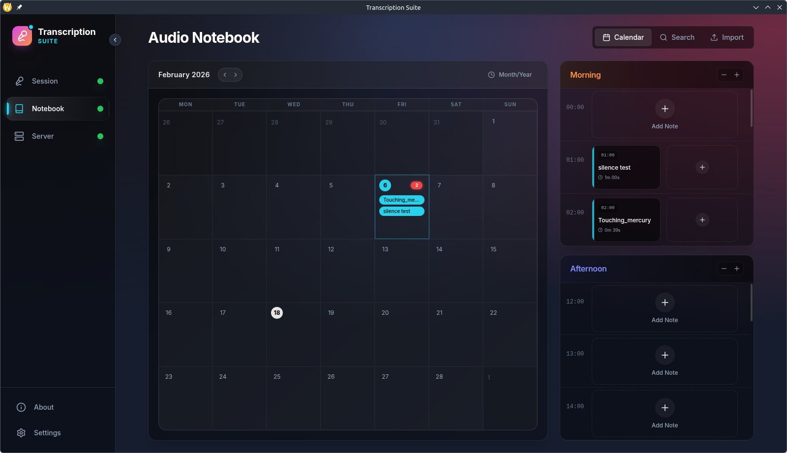
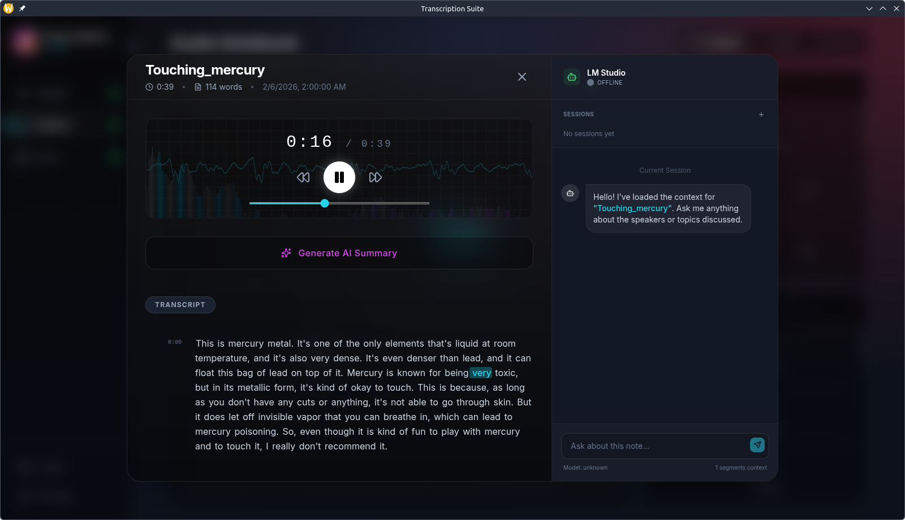
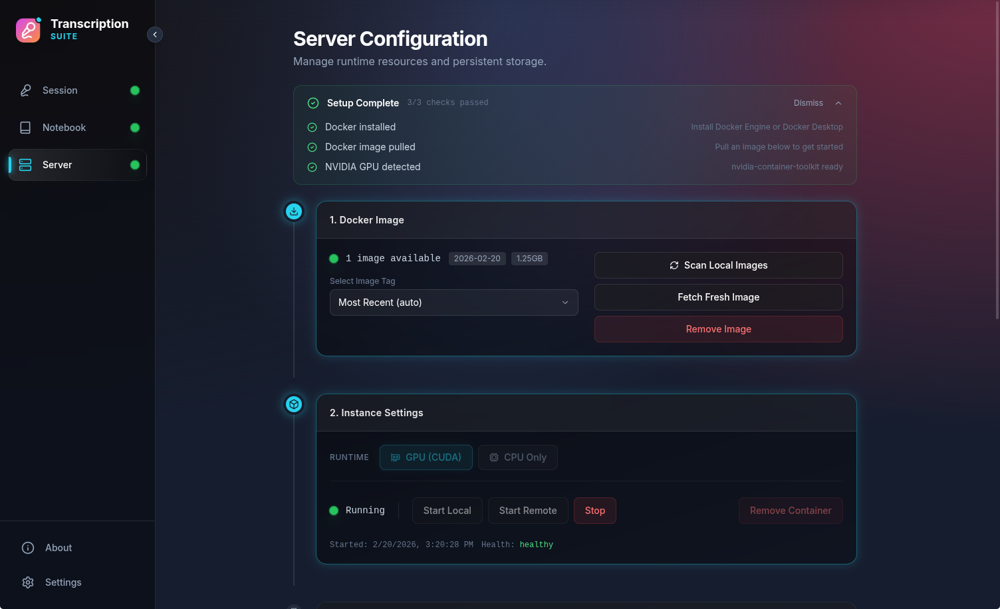
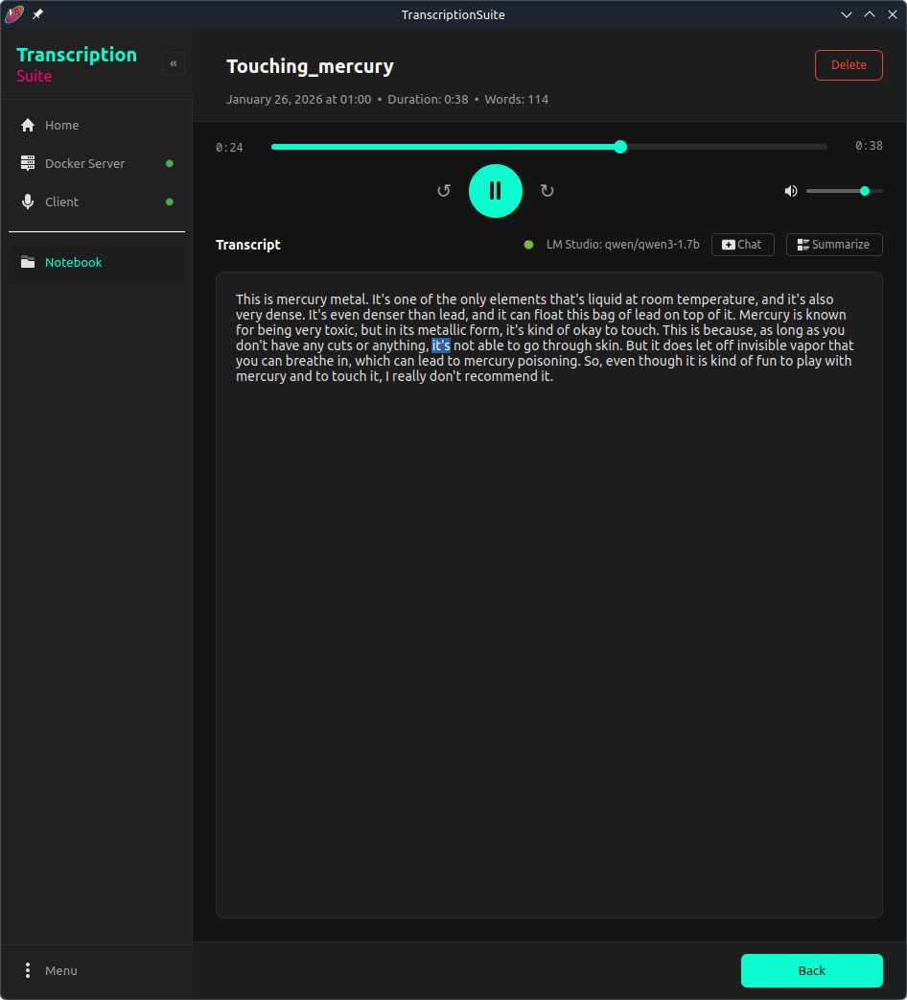
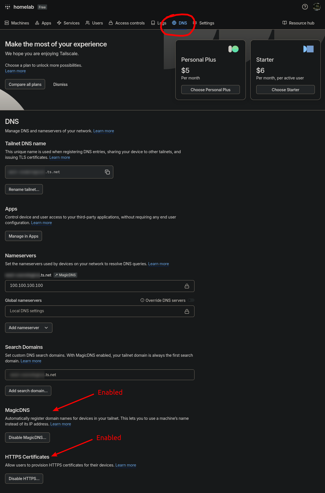

# TranscriptionSuite


<table>
  <tr>
    <td width="375px">
<pre>
A fully local & private Speech-To-Text app
with cross-platform support offering
advanced features like diarization, audio
notebook mode and LM Studio integration.
Longform & Live Transcription available.
Written in Python, utilizing faster-whisper
and NVIDIA GPU acceleration. Server/client
architecture; server is Dockerized for
easy installation.
</pre>
    </td>
  </tr>
</table>

**OS Support:**

  

**GPU Hardware Support:**


---

## Table of Contents

- [1. Features](#1-features)
- [2. Prerequisites](#2-prerequisites)
  - [2.1 Docker](#21-docker)
  - [2.2 Git](#22-git)
- [3. Installation](#3-installation)
- [4. Usage](#4-usage)
  - [4.1 Tray Icon Colors](#41-tray-icon-colors)
  - [4.2 Dashboard GUI](#42-dashboard-gui)
- [5. First time setup](#5-first-time-setup)
  - [5.1 Starting the Server & Client](#51-starting-the-server--client)
- [6. Remote Access](#6-remote-access)
  - [6.1 Step 1: Set Up Tailscale](#61-step-1-set-up-tailscale)
  - [6.2 Step 2: Generate Certificates](#62-step-2-generate-certificates)
  - [6.3 Remote Access Without MagicDNS](#63-remote-access-without-magicdns)
    - [6.3.1 Option 1: IP-Only Mode (Recommended)](#631-option-1-ip-only-mode-recommended)
    - [6.3.2 Option 2: Self-Signed Certificates](#632-option-2-self-signed-certificates)
    - [6.3.3 Why MagicDNS is Recommended](#633-why-magicdns-is-recommended)
- [7. Web Interface](#7-web-interface)
- [8. Database & Backups](#8-database--backups)
- [9. Troubleshooting](#9-troubleshooting)
  - [9.1 Server Won't Start](#91-server-wont-start)
  - [9.2 GPU Not Detected](#92-gpu-not-detected)
  - [9.3 Connection Issues (Remote Mode)](#93-connection-issues-remote-mode)
- [10. License](#10-license)
- [11. Acknowledgments](#11-acknowledgments)

---

## 1. Features

- **100% Local**: *Everything* runs on your own computer, the app doesn't need internet
  beyond the initial setup
- **Truly Multilingual**: Supports [90+ languages](https://github.com/openai/whisper/blob/main/whisper/tokenizer.py)
- **Fully featured GUI**: Native app for KDE, GNOME, and Windows
- **Longform Transcription**: Record as long as you want and have it transcribed in seconds
- **Live Mode**: Real-time sentence-by-sentence transcription for continuous dictation workflows
- **Static File Transcription**: Transcribe an existing audio/video file
- **Remote Access**: Securely access your desktop at home running the model from anywhere
  (utilizing Tailscale)
- **Speaker Diarization**: PyAnnote-based speaker identification
- **Audio Notebook**: An Audio Notebook mode, with a calendar-based view,
  full-text search, and LM Studio integration (chat about your notes with the AI)
  - Supports LM Studio 0.4.0+ with native v1 REST API for model management and stateful chats

📌*Half an hour of audio transcribed in under a minute (RTX 3060)!*

<div align="center">

#### Screenshots

##### Dashboard
<table>
  <tr>
    <td></td>
    <td></td>
  </tr>
</table>

##### Audio Notebook
<table>
  <tr>
    <td></td>
    <td></td>
  </tr>
  <tr>
    <td colspan="2" align="center"></td>
  </tr>
</table>

</div>


<div align="center">

#### Videos

Longform Transcription demo:

https://github.com/user-attachments/assets/b38955c6-12d3-4810-979d-ce1475d2b165

Live Transcription demo:

https://github.com/user-attachments/assets/aaada672-08aa-4735-8beb-3825ead031bd

Audio Notebook demo:

https://github.com/user-attachments/assets/afc55551-98b9-4be6-98b2-a7f426d7025a

</div>

---

## 2. Prerequisites

### 2.1 Docker

**Linux:**

1. Install Docker Engine
    * For Arch run `sudo pacman -S --needed docker`
    * For other distros refer to the [Docker documentation](https://docs.docker.com/engine/install/)
2. Install NVIDIA Container Toolkit (for GPU support)
    * Refer to the [NVIDIA documentation](https://docs.nvidia.com/datacenter/cloud-native/container-toolkit/install-guide.html)

**Windows:**
1. Install [Docker Desktop](https://www.docker.com/products/docker-desktop/) with WSL2 backend (during installation make sure the
  *'Use WSL 2 instead of Hyper-V'* checkbox is enabled)
2. Install NVIDIA GPU driver with WSL support (standard NVIDIA gaming drivers work fine)

### 2.2 Git

**Linux:**

* For Arch run `sudo pacman -S --needed git`
* For Ubuntu/Debian run `sudo apt install git`
* For other distros refer to the [Git documentation](https://git-scm.com/install/linux)

**Windows:**
* Download and install [Git for Windows](https://git-scm.com/download/win)

---

## 3. Installation

Setup Guide/Tutorial:

https://github.com/user-attachments/assets/2e5beea5-3417-4d08-afb9-815f47adf5d8

Download the Dashboard for your platform from the [Releases](https://github.com/homelab-00/TranscriptionSuite/releases) page:

| Platform | Download | Notes |
|----------|----------|-------|
| **KDE** | `TranscriptionSuite-KDE.AppImage` | Standalone, no dependencies |
| **GNOME** | `TranscriptionSuite-GNOME.AppImage` | Requires system packages (see below) |
| **Windows** | `TranscriptionSuite.exe` | Standalone, no dependencies |

>* *These are all x64 packages*
>* *The Linux versions were developed on, and are targeting for, Wayland not X11*

If using the GNOME version, you need to also install the following packages:

**Ubuntu 24.04:**
```bash
sudo apt install python3 python3-gi gir1.2-appindicator3-0.1 python3-pyaudio \
                 python3-numpy python3-aiohttp python3-pyqt6 wl-clipboard
```

**Fedora:**
```bash
sudo dnf install python3 python3-gobject gtk3 libappindicator-gtk3 python3-pyaudio \
                 python3-numpy python3-aiohttp python3-qt6 wl-clipboard
```

**Arch Linux:**
```bash
sudo pacman -S --needed python python-gobject gtk3 libappindicator-gtk3 python-pyaudio \
                        python-numpy python-aiohttp python-pyqt6 wl-clipboard
```

---

## 4. Usage

**Quick start:**

* Run the AppImage or executable
* The tray icon appears in your system tray
* **Longform Transcription**
  * To start recording:
    * On KDE & Windows left click on the system tray icon
    * On GNOME left click on the system tray icon and the select 'Start Recording'
  * To stop and transcribe:
    * On KDE middle click on the system tray icon
    * On Windows double click on the system tray icon
    * On GNOME left click on the system tray icon and the select 'Stop Recording'
* **Static transcription**
  * Right click on the system tray and select 'Transcribe File...'
* **Live Mode** (Dashboard only)
  * Open the Dashboard window and navigate to the Client View
  * Enable "Live Transcriber" toggle to activate continuous transcription
  * Speak naturally with pauses - sentences appear in real-time as you speak
  * Mute/unmute with the toggle button to control when audio is captured
  * Completed sentences are shown in the transcription display
  * Optionally select a specific language for better accuracy (auto-detect may struggle with short utterances)

Result is automatically copied to clipboard

### 4.1 Tray Icon Colors

| Color | State |
|-------|-------|
| 🟢 | Ready |
| 🟡 | Recording |
| 🟠 | Transcribing |
| 🔵 | Uploading |
| ⚫ | Disconnected / Models Unloaded |
| 🔴 | Error |
| 🔴 (Bright) | Live Mode - Listening |
| 🟤 (Dark) | Live Mode - Muted |

### 4.2 Dashboard GUI

The app includes a full Docker & client management GUI. Click the tray icon and select
"Show App" to open the Dashboard window, which features a **sidebar navigation** with:

- **Home**: Overview with status indicators for Server and Client
- **Notebook**: Audio Notebook with Calendar, Search, and Import sub-tabs
- **Docker Server**: Full Docker management including:
  - Container and image status with health indicators
  - Volume status with sizes and downloaded models list
  - 3-column management section (Container | Image | Volumes)
  - Server configuration with Settings button
- **Client**: Start/stop client, configure settings
- **Menu**: Settings, Help (User Guide / Developer Guide), and About

**Status Lights**: The sidebar shows real-time status indicators next to Server and Client:
- 🟢 Green: Running/Healthy
- 🔴 Red: Unhealthy
- 🔵 Blue: Starting
- 🟠 Orange: Stopped
- ⚪ Gray: Not set up

---

## 5. First time setup

**Before starting either Client or Server, you need to configure a few settings.**

To access them, click on the hamburger menu and select Settings. A new
window will open up with four tabs: `App`, `Client`, `Server`, and `Notebook`.
Let's go through each one:
* The settings in the `App` tab are self explanatory
* The `Server` tab is just a button that opens the full `config.yaml` for the server.
  You generally don't need to worry about it unless you want to change the model or
  other server parameters. Refer to [README_DEV.md](README_DEV.md) for more information.
* The `Notebook` tab provides database backup and restore functionality:
  - Create manual backups of your Audio Notebook database
  - View list of available backups with timestamps and sizes
  - Restore from any backup (creates safety backup first)
* For the `Client` tab, the first thing you need to know is whether you want a local or
  a remote connection. I'll list both cases:
  * Local: All you need to do is select your input device. Leave everything else default.
  * Remote: Go through [Section 6: Remote Access](#6-remote-access) first to set up Tailscale.
    Then:
    *(Note - These settings are for MagicDNS & HTTPS enabled in Tailscale)*
    * In the 'Remote Host' field enter your hostname as suggested by the hint
    * Click on the 'Use remote server instead of local' checkbox
    * Enter your auth token in the field (you'll get this token once you start the server
      for the first time)
    * Change the port to 8443
    * Select the 'Use HTTPS' checkbox

*Settings are saved to:*
*- Linux: `~/.config/TranscriptionSuite/`*
*- Windows: `%APPDATA%\TranscriptionSuite\`*

### 5.1 Starting the Server & Client

You're now ready to start both Server & Client. Let's start with the Server:
* Click on 'Fetch Fresh' and wait for the Docker server image to download
* Then depending on whether you want to start the server in local or remote mode:
  * Local: Just click on 'Start Local'
  * Remote: Click on 'Start Remote', then copy the auth token that appears and
    paste it over to the client settings (on the remote machine).

Wait until the container has fully started. Then, head over to the Client tab and click
the appropriate button. You should now be connected.

---

## 6. Remote Access

As previously mentioned, TranscriptionSuite gives you the ability to remote connect from
one machine running the app to another, via Tailscale.

It uses a **layered security model** for remote access:

| Layer | Protection |
|-------|------------|
| **Tailscale Network** | Only devices on your Tailnet can reach the server |
| **TLS/HTTPS** | All traffic encrypted with Tailscale certificates |
| **Token Authentication** | Required for all API requests in remote mode |

### 6.1 Step 1: Set Up Tailscale

1. Install Tailscale: [tailscale.com/download](https://tailscale.com/download)
2. Authenticate: `sudo tailscale up` (Linux) or via the app (Windows)
3. Go to [Tailscale Admin Console](https://login.tailscale.com/admin) → DNS tab
4. Enable **MagicDNS** and **HTTPS Certificates**

Your DNS settings should look like this:



### 6.2 Step 2: Generate Certificates

Note: You only need to do this on the machine you'll be using as the *server*.

```bash
# Generate certificate for your machine
sudo tailscale cert your-machine.your-tailnet.ts.net
```

Move the certificates to the standard location:
*(Note: To change the default location and name of the certs the app is looking for,*
*edit the `remote_server` section in `config.yaml`.)*

**Linux:**
```bash
mkdir -p ~/.config/Tailscale
mv your-machine.your-tailnet.ts.net.crt ~/.config/Tailscale/my-machine.crt
mv your-machine.your-tailnet.ts.net.key ~/.config/Tailscale/my-machine.key
sudo chown $USER:$USER ~/.config/Tailscale/my-machine.*
chmod 600 ~/.config/Tailscale/my-machine.key
```

**Windows (PowerShell):**
```powershell
mkdir "$env:USERPROFILE\Documents\Tailscale" -Force
mv your-machine.your-tailnet.ts.net.crt "$env:USERPROFILE\Documents\Tailscale\my-machine.crt"
mv your-machine.your-tailnet.ts.net.key "$env:USERPROFILE\Documents\Tailscale\my-machine.key"
```

For Windows, you also need to edit a couple of lines in `config.yaml`:
* Change `~/.config/Tailscale/my-machine.crt` to `~/Documents/Tailscale/my-machine.crt`
* Change `~/.config/Tailscale/my-machine.key` to `~/Documents/Tailscale/my-machine.key`

### 6.3 Remote Access Without MagicDNS

If you cannot or prefer not to use Tailscale MagicDNS, you have alternative options.

#### 6.3.1 Option 1: IP-Only Mode (Recommended)

Use Tailscale IPs directly with HTTP. WireGuard encrypts all traffic at the network layer.

**Server:** Start with `./start-local.sh` (HTTP on port 8000)

**Client:**
1. Find server's Tailscale IP: `tailscale ip -4`
2. Configure:
   - Host: `100.x.y.z` (Tailscale IP)
   - Port: `8000`
   - HTTPS: Off
   - Settings → Advanced TLS Options: Enable "Allow HTTP to remote hosts"

**Security:** WireGuard encrypts all Tailscale traffic. HTTP over Tailscale is secure
for single-user setups.

#### 6.3.2 Option 2: Self-Signed Certificates

For HTTPS without MagicDNS:

1. Generate certificates:
   ```bash
   openssl req -x509 -newkey rsa:4096 -keyout server.key -out server.crt \
       -days 365 -nodes -subj "/CN=100.x.y.z"
   ```

2. Configure server with certificates (see [README_DEV.md](README_DEV.md))

3. Configure client:
   - Host: `100.x.y.z`
   - Port: `8443`
   - HTTPS: On
   - Settings → Advanced TLS Options: Uncheck "Verify TLS certificates"

#### 6.3.3 Why MagicDNS is Recommended

Tailscale HTTPS certificates require MagicDNS because:
- Certificates are issued for `.ts.net` hostnames, not IP addresses
- This is a Let's Encrypt/CA limitation, not Tailscale-specific

Enable MagicDNS in [Tailscale Admin Console](https://login.tailscale.com/admin/dns) for the best experience.

---

## 7. Web Interface

Access the web interface at your server's address:
- **Local**: http://localhost:8000
- **Remote**: https://your-machine.your-tailnet.ts.net:8443

It offers two things; the Audio Notebook mode and web implementation of the client.
The Notebook features are listed below. The web client is a way to access the
transcription service on devices without Dashboard app builds.

**Audio Notebook Features:**
- Calendar view of recordings with day/month views
- Full-text search across all transcriptions
- Audio playback with click-to-seek timestamps
- AI chat about recordings (requires LM Studio)
- Import external audio files with drag-and-drop
- Export transcriptions in text or JSON format (with word-level timestamps and diarization data)
- Context menu actions: Export, Change date/time, Delete

---

## 8. Database & Backups

TranscriptionSuite automatically backs up the SQLite database on server startup:

- Backups are stored in the Docker volume (`/data/database/backups/`)
- A new backup is created if the latest is more than 1 hour old
- Up to 3 backups are kept (oldest automatically deleted)
- Uses SQLite's built-in backup API (safe with concurrent access)

**Configuration** (in `config.yaml`):
```yaml
backup:
    enabled: true        # Enable/disable automatic backups
    max_age_hours: 1     # Backup if latest is older than this
    max_backups: 3       # Number of backups to keep
```

**Manual Backup via Dashboard:**

The Dashboard provides a graphical interface for backup management:
1. Open Settings → Notebook tab
2. Click "Create Backup" to create a new backup
3. View list of available backups with timestamps and sizes
4. Select a backup and click "Restore Selected Backup" to restore

**Manual Backup via Command Line:**
```bash
# Stop the server first
docker compose down

# Copy the database file
docker run --rm -v transcriptionsuite-data:/data -v $(pwd):/backup \
    alpine cp /data/database/notebook.db /backup/notebook_backup.db

# Restart the server
docker compose up -d
```

**Export Individual Recordings:**

You can export individual transcriptions from the Audio Notebook:
1. Right-click on any recording in the Calendar view
2. Select "Export transcription"
3. Choose format (Text or JSON)
4. Select save location

The JSON format includes word-level timestamps and speaker diarization data.

---

## 9. Troubleshooting

### 9.1 Server Won't Start

Check Docker logs:
```bash
docker compose logs -f
```

Alternatively install `lazydocker`, it's an excellent cli tool to manage docker.
*(Then simply run it by running `lazydocker` in your terminal. Select your container on*
*the left and you'll see its logs on the right.)*

### 9.2 GPU Not Detected

Verify NVIDIA Container Toolkit is installed:
```bash
docker run --rm --gpus all nvidia/cuda:12.9.0-base-ubuntu24.04 nvidia-smi
```

### 9.3 Connection Issues (Remote Mode)

1. Verify Tailscale is connected: `tailscale status`
2. Check certificate paths in `config.yaml`
3. Ensure port 8443 is used for HTTPS

**DNS Resolution Errors:**

If you see errors like `Name or service not known` for `.ts.net` hostnames:

- **Automatic fallback:** The client automatically tries to use Tailscale IP addresses
  when DNS fails. Check the logs for "Tailscale IP fallback" messages.
- **Check for DNS fight:** Run `tailscale status` and look for DNS warnings. If you see
  `/etc/resolv.conf overwritten`, your system's DNS isn't forwarding to
  Tailscale's MagicDNS.
- **Manual workaround:** Use the Tailscale IP directly: `--host 100.x.x.x` (find IPs
  with `tailscale status`)

See [README_DEV.md](README_DEV.md#tailscale-dns-resolution-issues) for detailed troubleshooting.

---

## 10. License

MIT License — See [LICENSE](LICENSE).

---

## 11. Acknowledgments

- [Faster Whisper](https://github.com/SYSTRAN/faster-whisper)
- [OpenAI Whisper](https://github.com/openai/whisper)
- [PyAnnote Audio](https://github.com/pyannote/pyannote-audio)
- [Tailscale](https://tailscale.com/)
- [RealtimeSTT](https://github.com/KoljaB/RealtimeSTT)
