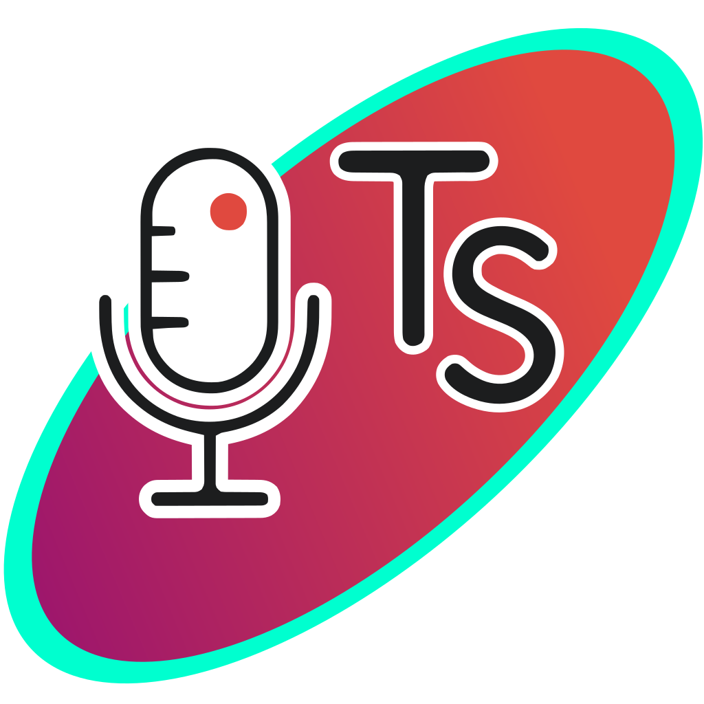

# TranscriptionSuite



<pre>A comprehensive Speech-to-Text Transcription Suite with Docker-first
architecture. Written in Python, utilizing faster_whisper with
GPU acceleration.
</pre>

## Features

- **Multilingual**: Supports [90+ languages](https://platform.openai.com/docs/guides/speech-to-text/supported-languages)
- **GPU Accelerated**: NVIDIA GPU support via PyTorch bundled CUDA/cuDNN
- **Long-form Dictation**: Real-time transcription with optional live preview
- **Static File Transcription**: Transcribe audio/video files
- **Speaker Diarization**: PyAnnote-based speaker identification
- **Audio Notebook**: Calendar-based audio notes with full-text search, AI chat about your notes via LM Studio
- **Remote Access**: Secure access via Tailscale + TLS from anywhere
- **Cross-Platform Clients**: Native system tray apps for KDE, GNOME, and Windows

📌*Half an hour of audio transcribed in under a minute (RTX 3060)!*

---

## Prerequisites

### Docker

**Linux:**
```bash
# Install Docker Engine
# See: https://docs.docker.com/engine/install/

# Install NVIDIA Container Toolkit (for GPU support)
# See: https://docs.nvidia.com/datacenter/cloud-native/container-toolkit/install-guide.html
```

**Windows:**
1. Install [Docker Desktop](https://www.docker.com/products/docker-desktop/) with WSL2 backend
2. Install NVIDIA GPU driver with WSL support

### Git

**Linux:**
```bash
# Debian/Ubuntu
sudo apt install git

# Arch Linux
sudo pacman -S git
```

**Windows:**
Download and install [Git for Windows](https://git-scm.com/download/win)

### Verify GPU Support

```bash
docker run --rm --gpus all nvidia/cuda:12.6.0-base-ubuntu22.04 nvidia-smi
```

---

## Installation

### Step 1: Clone the Repository

**From GitHub:**
```bash
git clone https://github.com/homelab-00/TranscriptionSuite.git
cd TranscriptionSuite
```

**Or from GitLab:**
*Note: GitLab repository is private, use GitHub.*
```bash
git clone https://gitlab.com/bluemoon7/transcription-suite.git
cd transcription-suite
```

### Step 2: Run Setup Script

**Linux:**
```bash
cd build/user-setup
./setup.sh
```

**Windows (PowerShell):**
```powershell
cd build\user-setup
.\setup.ps1
```

The setup script will:
1. Check that Docker is installed and running
2. Create the config directory with all necessary files
3. Pull the Docker image from GitHub Container Registry

### Step 3: Configure HuggingFace Token (Optional)

For speaker diarization, you need a HuggingFace token:

1. Create a free account at [huggingface.co](https://huggingface.co)
2. Go to Settings → Access Tokens → Create new token (Read permissions)
3. Accept the [PyAnnote model license](https://huggingface.co/pyannote/speaker-diarization-community-1)

**Linux:**
```bash
nano ~/.config/TranscriptionSuite/.env
# Add: HUGGINGFACE_TOKEN=hf_your_token_here
```

**Windows:**
```powershell
notepad "$env:USERPROFILE\Documents\TranscriptionSuite\.env"
# Add: HUGGINGFACE_TOKEN=hf_your_token_here
```

### Step 4: Start the Server (Local Mode)

**Linux:**
```bash
cd ~/.config/TranscriptionSuite
./start-local.sh
```

**Windows:**
```powershell
cd "$env:USERPROFILE\Documents\TranscriptionSuite"
.\start-local.ps1
```

Access the web interface at **http://localhost:8000**

### Stop the Server

**Linux:**
```bash
cd ~/.config/TranscriptionSuite
./stop.sh
```

**Windows:**
```powershell
cd "$env:USERPROFILE\Documents\TranscriptionSuite"
.\stop.ps1
```

---

## Remote Access (Optional)

TranscriptionSuite uses a **layered security model** for remote access:

| Layer | Protection |
|-------|------------|
| **Tailscale Network** | Only devices on your Tailnet can reach the server |
| **TLS/HTTPS** | All traffic encrypted with Tailscale certificates |
| **Token Authentication** | Required for all API requests in remote mode |

### Step 1: Set Up Tailscale

1. Install Tailscale: [tailscale.com/download](https://tailscale.com/download)
2. Authenticate: `tailscale up` (Linux) or via the app (Windows)
3. Go to [Tailscale Admin Console](https://login.tailscale.com/admin) → DNS tab
4. Enable **MagicDNS** and **HTTPS Certificates**

Your DNS settings should look like this:


### Step 2: Generate Certificates

```bash
# Generate certificate for your machine
sudo tailscale cert your-machine.your-tailnet.ts.net
```

Move the certificates to the standard location:

**Linux:**
```bash
mkdir -p ~/.config/Tailscale
mv your-machine.your-tailnet.ts.net.crt ~/.config/Tailscale/my-machine.crt
mv your-machine.your-tailnet.ts.net.key ~/.config/Tailscale/my-machine.key
sudo chown $USER:$USER ~/.config/Tailscale/my-machine.*
chmod 600 ~/.config/Tailscale/my-machine.key
```

**Windows (PowerShell):**
```powershell
mkdir "$env:USERPROFILE\Documents\Tailscale" -Force
mv your-machine.your-tailnet.ts.net.crt "$env:USERPROFILE\Documents\Tailscale\my-machine.crt"
mv your-machine.your-tailnet.ts.net.key "$env:USERPROFILE\Documents\Tailscale\my-machine.key"
```

### Step 3: Configure TLS Paths

Edit your config file to set the certificate paths:

**Linux:**
```bash
nano ~/.config/TranscriptionSuite/config.yaml
```

**Windows:**
```powershell
notepad "$env:USERPROFILE\Documents\TranscriptionSuite\config.yaml"
```

Update the `remote_server.tls` section:
```yaml
remote_server:
  tls:
    host_cert_path: "~/.config/Tailscale/my-machine.crt"
    host_key_path: "~/.config/Tailscale/my-machine.key"
```

### Step 4: Start Server (Remote Mode)

**Linux:**
```bash
cd ~/.config/TranscriptionSuite
./start-remote.sh
```

**Windows:**
```powershell
cd "$env:USERPROFILE\Documents\TranscriptionSuite"
.\start-remote.ps1
```

### Step 5: Save the Admin Token (First Run Only)

On first startup, an admin token is automatically generated. **Save this token!**

```bash
# Wait ~10 seconds for startup, then:
docker compose logs | grep "Admin Token"
```

Use this token to log in at `https://your-machine.your-tailnet.ts.net:8443`

---

## Native Client

Download the native client for your platform:

| Platform | Download | Notes |
|----------|----------|-------|
| **KDE Plasma** | `TranscriptionSuite-KDE-x86_64.AppImage` | Standalone, no dependencies |
| **GNOME** | `TranscriptionSuite-GNOME-x86_64.AppImage` | Requires system packages (see below) |
| **Windows** | `TranscriptionSuite.exe` | Standalone, no dependencies |

### First-Time Setup

On first run, the client automatically performs initial setup:
1. Checks Docker availability
2. Creates the config directory with required files
3. Pulls the Docker image from GitHub Container Registry

This replaces the manual `setup.sh`/`setup.ps1` script execution for most users.

### GNOME Client Dependencies (Ubuntu/Debian)

The GNOME client requires system packages:

```bash
sudo apt install python3 python3-gi gir1.2-appindicator3-0.1 python3-pyaudio python3-numpy python3-aiohttp
```

You also need the [AppIndicator extension](https://extensions.gnome.org/extension/615/appindicator-support/) for the tray icon.

### Usage

1. Run the AppImage or executable
2. The tray icon appears in your system tray
3. **Left-click** to start recording
4. **Middle-click** to stop and transcribe
5. Result is automatically copied to clipboard

### Docker Server Control

The client includes a full Docker management GUI. Click the tray icon and select "Show App" to open the Mothership window, which provides:

- **Server View**: Full Docker management including:
  - Container and image status with health indicators
  - Volume status with sizes and downloaded models list
  - 3-column management section (Container | Image | Volumes)
  - Server configuration with Settings button
- **Client View**: Start/stop client, configure settings
- **Help Menu**: Access built-in documentation (User Guide / Developer Guide)
- **About Dialog**: Application info and links to GitHub/GitLab
- Navigation bar with Home, Server, Client, Help, and About buttons (all with icons)

The tray menu also provides quick access:

| Menu Item | Action |
|-----------|--------|
| **Docker Server → Start Server (Local)** | Start in HTTP mode (port 8000) |
| **Docker Server → Start Server (Remote)** | Start in HTTPS mode (port 8443) |
| **Docker Server → Stop Server** | Stop the running server |

This eliminates the need to run scripts manually from the command line.

### Tray Icon Colors

| Color | State |
|-------|-------|
| Grey | Disconnected |
| Green | Ready |
| Yellow | Recording |
| Blue | Uploading |
| Orange | Transcribing |
| Red | Error |

### Client Configuration

On first connection, enter the server details:
- **Local mode**: Host `localhost`, Port `8000`, HTTPS off
- **Remote mode**: Host `your-machine.your-tailnet.ts.net`, Port `8443`, HTTPS on, Token from server logs

Settings are saved to:
- **Linux**: `~/.config/TranscriptionSuite/client.yaml`
- **Windows**: `%APPDATA%\TranscriptionSuite\client.yaml`

---

## Web Interface

Access the web interface at your server's address:
- **Local**: http://localhost:8000
- **Remote**: https://your-machine.your-tailnet.ts.net:8443

**Features:**
- Calendar view of recordings
- Full-text search across all transcriptions
- Audio playback with click-to-seek timestamps
- AI chat about recordings (requires LM Studio)
- Import external audio files

---

## Database & Backups

TranscriptionSuite automatically backs up the SQLite database on server startup:

- Backups are stored in the Docker volume (`/data/database/backups/`)
- A new backup is created if the latest is more than 1 hour old
- Up to 3 backups are kept (oldest automatically deleted)
- Uses SQLite's built-in backup API (safe with concurrent access)

**Configuration** (in `config.yaml`):
```yaml
backup:
    enabled: true        # Enable/disable automatic backups
    max_age_hours: 1     # Backup if latest is older than this
    max_backups: 3       # Number of backups to keep
```

**Manual Backup:**
```bash
# Stop the server first
docker compose down

# Copy the database file
docker run --rm -v transcription-suite-data:/data -v $(pwd):/backup \
    alpine cp /data/database/notebook.db /backup/notebook_backup.db

# Restart the server
docker compose up -d
```

---

## Troubleshooting

### Server Won't Start

Check Docker logs:
```bash
docker compose logs -f
```

### GPU Not Detected

Verify NVIDIA Container Toolkit is installed:
```bash
docker run --rm --gpus all nvidia/cuda:12.6.0-base-ubuntu22.04 nvidia-smi
```

### GNOME Tray Icon Not Showing

Install the [AppIndicator extension](https://extensions.gnome.org/extension/615/appindicator-support/).

### Connection Issues (Remote Mode)

1. Verify Tailscale is connected: `tailscale status`
2. Check certificate paths in `config.yaml`
3. Ensure port 8443 is used for HTTPS

**DNS Resolution Errors:**

If you see errors like `Name or service not known` for `.ts.net` hostnames:

- **Automatic fallback:** The client automatically tries to use Tailscale IP addresses when DNS fails. Check the logs for "Tailscale IP fallback" messages.
- **Check for DNS fight:** Run `tailscale status` and look for DNS warnings. If you see `/etc/resolv.conf overwritten`, your system's DNS isn't forwarding to Tailscale's MagicDNS.
- **Manual workaround:** Use the Tailscale IP directly: `--host 100.x.x.x` (find IPs with `tailscale status`)

See [README_DEV.md](README_DEV.md#tailscale-dns-resolution-issues) for detailed troubleshooting.

---

## License

MIT License — See [LICENSE](LICENSE).

## Acknowledgments

- [Faster Whisper](https://github.com/SYSTRAN/faster-whisper)
- [OpenAI Whisper](https://github.com/openai/whisper)
- [PyAnnote Audio](https://github.com/pyannote/pyannote-audio)
- [Tailscale](https://tailscale.com/)
