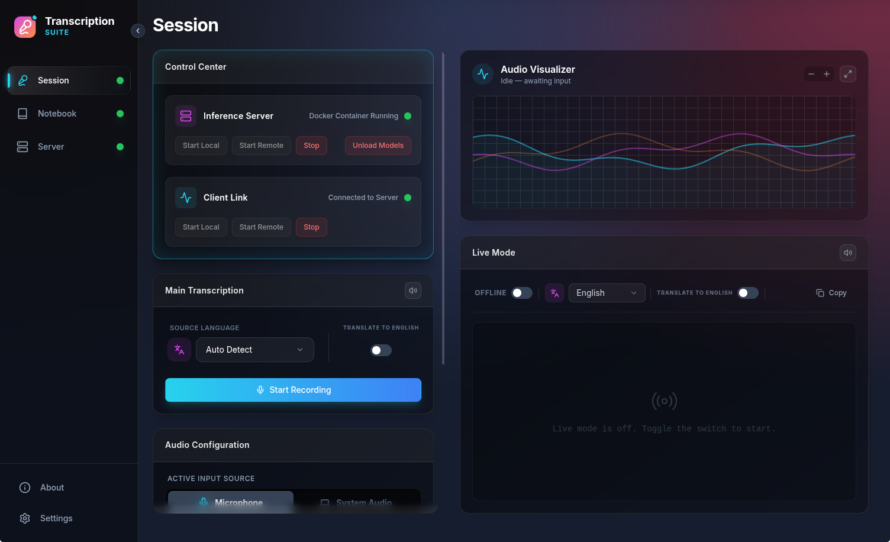
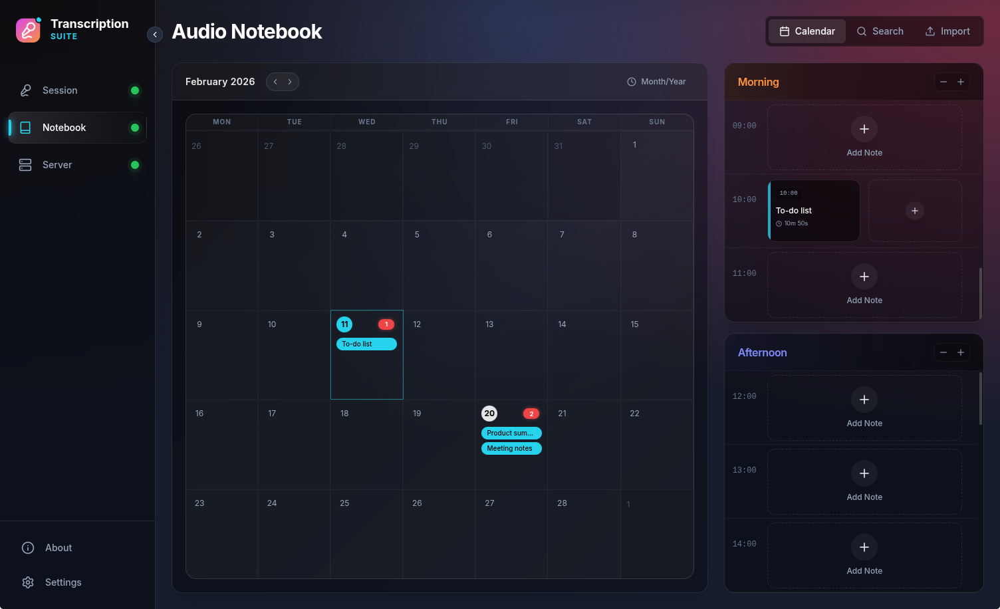
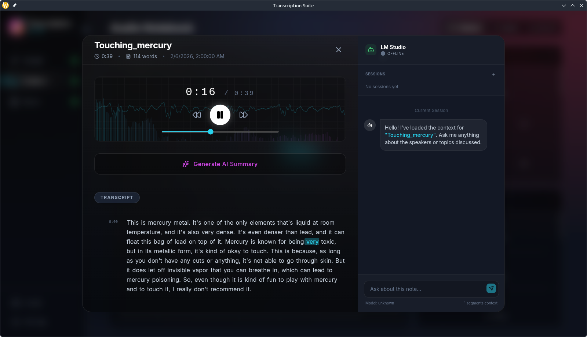
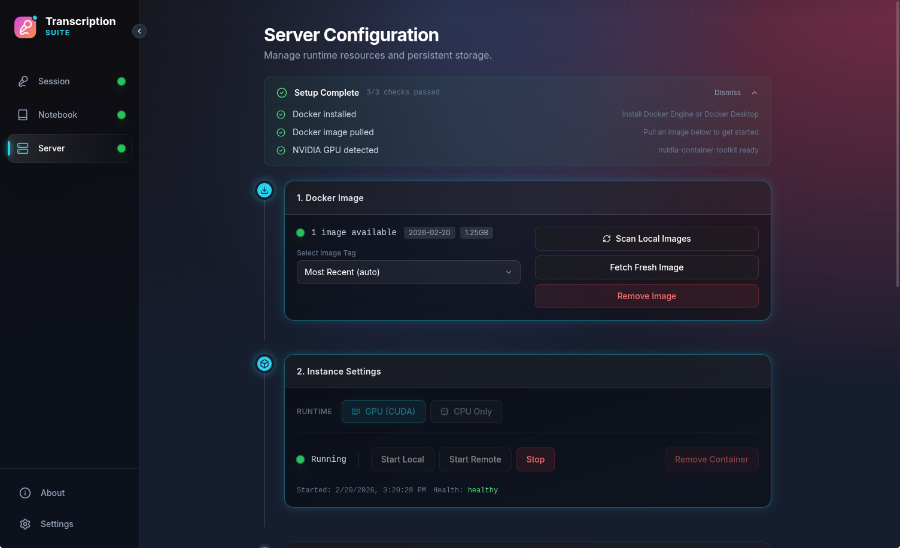

<p align="left">
  
</p>

<table width="100%">
  <tr>
    <td valign="top">
      <table>
        <tr>
          <td width="375px">
<pre>
A fully local and private Speech-To-Text
app with cross-platform support, speaker
diarization, Audio Notebook mode,
LM Studio integration, and both longform
and live transcription. Electron
dashboard + Python backend with
multi-backend STT (Whisper, NVIDIA NeMo,
VibeVoice-ASR), NVIDIA GPU acceleration
or CPU mode. Dockerized for fast setup.
</pre>
          </td>
        </tr>
      </table>
    </td>
    <td align="left" valign="top" width="280px">
      <br>
      <strong>OS Support:</strong><br>
      
      <br>
      Experimental:<br>
      <br><br>
      <strong>Hardware Acceleration:</strong><br>
      <br>
      
    </td>
  </tr>
</table>

<br>

<div align="center">

**Demo**

https://github.com/user-attachments/assets/13063bf9-0e1d-4688-af84-cb21686c7f41

</div>

---

## Table of Contents

- [1. Introduction](#1-introduction)
  - [1.1 Features](#11-features)
  - [1.2 Screenshots](#12-screenshots)
- [2. Prerequisites](#2-prerequisites)
  - [2.1 Docker](#21-docker)
- [3. Installation](#3-installation)
  - [3.1 Verify Download (Kleopatra)](#31-verify-download-kleopatra)
- [4. First time setup](#4-first-time-setup)
  - [4.1 Starting the Server & Client](#41-starting-the-server--client)
- [5. Usage](#5-usage)
  - [5.1 Quick Start](#51-quick-start)
  - [5.2 Dashboard Views](#52-dashboard-views)
- [6. Remote Access](#6-remote-access)
  - [6.1 Step 1: Set Up Tailscale](#61-step-1-set-up-tailscale)
  - [6.2 Step 2: Generate Certificates](#62-step-2-generate-certificates)
- [7. Database & Backups](#7-database--backups)
- [8. Troubleshooting](#8-troubleshooting)
  - [8.1 Server Won't Start](#81-server-wont-start)
  - [8.2 GPU Not Detected](#82-gpu-not-detected)
  - [8.3 Connection Issues (Remote Mode)](#83-connection-issues-remote-mode)
- [9. License](#9-license)
- [10. Acknowledgments](#10-acknowledgments)

---

## 1. Introduction

### 1.1 Features

- **100% Local**: *Everything* runs on your own computer, the app doesn't need internet beyond the initial setup
- **Multi-Backend STT**: Whisper, NVIDIA NeMo Parakeet/Canary, and VibeVoice-ASR — backend auto-detected from the model name
- **Truly Multilingual**: Whisper supports [90+ languages](https://github.com/openai/whisper/blob/main/whisper/tokenizer.py); NeMo Parakeet supports 25 European languages
- **Model Manager**: Browse models by family, view capabilities, manage downloads/cache, and intentionally disable model slots with **None (Disabled)**
- **Fully featured GUI**: Electron desktop app for Linux, Windows, and macOS
- **GPU + CPU Mode**: NVIDIA CUDA acceleration (recommended), or CPU-only mode for any platform including macOS
- **Longform Transcription**: Record as long as you want and have it transcribed in seconds
- **Live Mode**: Real-time sentence-by-sentence transcription for continuous dictation workflows (Whisper-only in v1)
- **Speaker Diarization**: PyAnnote-based speaker identification
- **Static File Transcription**: Transcribe existing audio/video files with multi-file import queue, retry, and progress tracking
- **Global Keyboard Shortcuts**: System-wide shortcuts with Wayland portal support and paste-at-cursor
- **Remote Access**: Securely access your desktop at home running the model from anywhere
  (utilizing Tailscale)
- **Audio Notebook**: An Audio Notebook mode, with a calendar-based view,
  full-text search, and LM Studio integration (chat about your notes with the AI)
- **System Tray Control**: Quickly start/stop a recording, plus a lot of other controls, available via the system tray.

📌*Half an hour of audio transcribed in under a minute with Whisper (RTX 3060)!*

### 1.2 Screenshots

<div align="center">

**Session Tab**


**Notebook Tab**


**Audio Note View**


**Server Tab**


</div>

---

## 2. Prerequisites

### 2.1 Docker

**Linux:**

1. Install Docker Engine
    * For Arch run `sudo pacman -S --needed docker`
    * For other distros refer to the [Docker documentation](https://docs.docker.com/engine/install/)
2. Add your user to the `docker` group so the app can talk to Docker without `sudo`:
    ```bash
    sudo usermod -aG docker $USER
    ```
    Then **log out and back in** (or reboot) for the change to take effect.
3. Install NVIDIA Container Toolkit (for GPU mode)
    * Refer to the [NVIDIA documentation](https://docs.nvidia.com/datacenter/cloud-native/container-toolkit/install-guide.html)
    * Not required if using CPU mode

**Windows:**
1. Install [Docker Desktop](https://www.docker.com/products/docker-desktop/) with WSL2 backend (during installation make sure the
  *'Use WSL 2 instead of Hyper-V'* checkbox is enabled)
2. Install NVIDIA GPU driver with WSL support (standard NVIDIA gaming drivers work fine)
    * Not required if using CPU mode

**macOS (Apple Silicon):**
1. Install [Docker Desktop for Mac](https://www.docker.com/products/docker-desktop/)
2. GPU mode is not available on macOS — the server runs in CPU mode automatically

---

## 3. Installation

Download the Dashboard for your platform from the [Releases](https://github.com/homelab-00/TranscriptionSuite/releases) page:

| Platform | Download | Notes |
|----------|----------|-------|
| **Linux** | `TranscriptionSuite-x86_64.AppImage` | May require FUSE 2 (see below) |
| **Windows** | `TranscriptionSuite Setup.exe` | Standalone installer |
| **macOS** | `TranscriptionSuite-arm64.dmg` | Unsigned build for Apple Silicon |

>* *Linux and Windows builds are x64; macOS is arm64 (Apple Silicon)*
>* *Each release artifact includes an armored detached signature (`.asc`)*

#### Linux AppImage Prerequisites

AppImages require **FUSE 2** (`libfuse.so.2`), which is not installed by default on distros that ship with GNOME (both Fedora & Arch KDE worked fine out of the box). If you see `dlopen(): error loading libfuse.so.2`, install the appropriate package:

| Distribution | Package | Install Command |
|---|---|---|
| Ubuntu 22.04 / Debian | `libfuse2` | `sudo apt install libfuse2` |
| Ubuntu 24.04+ | `libfuse2t64` | `sudo apt install libfuse2t64` |
| Fedora | `fuse-libs` | `sudo dnf install fuse-libs` |
| Arch Linux | `fuse2` | `sudo pacman -S fuse2` |

> **Sandbox note:** The AppImage automatically disables Chromium's SUID sandbox
> (`--no-sandbox`) since the AppImage squashfs mount cannot satisfy its permission
> requirements. This is the standard approach for Electron-based AppImages and does
> not affect application security.

### 3.1 Verify Download (Kleopatra)

1. Download both files from the same release:
   - installer/app (`.AppImage`, `.exe` or `.dmg`)
   - matching signature file (`.sig`)
2. Install Kleopatra: https://apps.kde.org/kleopatra/
3. Import the public key in Kleopatra from this repository:
   - [`build/assets/homelab-00_0xBFE4CC5D72020691_public.asc`](./build/assets/homelab-00_0xBFE4CC5D72020691_public.asc)
4. In Kleopatra, use `File` -> `Decrypt/Verify Files...` and select the downloaded `.asc` signature.
5. If prompted, select the corresponding downloaded app file. Verification should report a valid signature.

---

## 4. First time setup

**Before starting either Client or Server, you need to configure a few settings.**

To access settings, click the Settings button in the sidebar (gear icon). The Settings
modal has four tabs: `App`, `Client`, `Server`, and `Notebook`.

* **App tab**: General application settings (notifications, auto-copy, etc.)
* **Server tab**: Opens  the full `config.yaml` for advanced server parameters.
  Refer to [README_DEV.md](README_DEV.md) for more information.
* **Notebook tab**: Database backup and restore functionality:
  - Create manual backups of your Audio Notebook database
  - View list of available backups with timestamps and sizes
  - Restore from any backup (creates safety backup first)
* **Client tab**: Configure connection mode:
  * **Local**: Use default settings (localhost:8000)
  * **Remote (Tailscale)**: See [Section 6.1: Tailscale Setup](#61-option-a-tailscale-recommended) for full instructions.
    Then configure:
    - Enable 'Use remote server instead of local'
    - Select **Tailscale** remote profile
    - Enter your Tailscale hostname (e.g., `my-machine.tail1234.ts.net`)
    - Set port to `8000`
    - Enable 'Use HTTPS'
    - Enter auth token (obtained after first server start)
  * **Remote (LAN)**: See [Section 6.2: LAN Setup](#62-option-b-lan-same-local-network) for connecting
    to a server on your local network without Tailscale.

*Settings are saved to:*
*- Linux: `~/.config/TranscriptionSuite/`*
*- Windows: `%APPDATA%\TranscriptionSuite\`*
*- macOS: `~/Library/Application Support/TranscriptionSuite/`*

### 4.1 Starting the Server & Client

You're now ready to start both Server & Client. Navigate to the **Server** view
in the sidebar:

1. Click 'Pull Image' to download the Docker server image (first time only)
2. Wait for the download to complete
3. Click 'Start Container' to launch the server
4. Wait for the container health status to turn green

Once the server is running, navigate to the **Session** view to start transcribing.

---

## 5. Usage

### 5.1 Quick Start

* Run the AppImage (Linux) or installer (Windows)
* The Dashboard window opens with sidebar navigation
* Navigate to **Session** view for transcription

**Longform Transcription:**
* Click the Record button to start capturing audio
* Click Stop to end recording and begin transcription
* Result appears in the transcription display and is auto-copied to clipboard

**Live Mode:**
* In the Session view, enable the Live Mode toggle
* Speak naturally with pauses — sentences appear in real-time
* Use Mute/Unmute to control audio capture
* Completed sentences accumulate in the display

**Static File Transcription:**
* Navigate to **Notebook** → **Import** tab
* Drag and drop audio/video files or click to browse
* Queue multiple files at once — each is transcribed with individual progress and retry on failure
* Completed files are automatically added to the Audio Notebook using the file name as the note title

**Translation (optional):**
* Enable `Translation` toggle in the Session controls
* **Whisper**: Translates source language → English (longform, file, Live Mode, Notebook)
* **Canary (NeMo)**: Bidirectional translation with 24 European target languages
* **Parakeet / VibeVoice-ASR**: No translation support (toggle auto-disabled)
* **Live Mode note**: Live Mode v1 supports Whisper backends only

### 5.2 Dashboard Views

The Dashboard features **sidebar navigation** with these main views:

- **Session**: Main transcription interface with:
  - Main Transcription controls (language, translate, record/stop) and Audio Configuration below
    - Microphone: dropdown to select input device
    - System Audio: silently captures all system audio via loopback (no device selection; enabled Chromium feature flags + IPC handler manage capture lifecycle)
  - Audio visualizer with amplitude zoom (+/− buttons, hover to reveal)
  - Live Mode toggle and real-time transcript display
  - Explicit disabled-slot messaging when Main and/or Live model is set to `None (Disabled)`
  - Transcription output with copy/download buttons
  - Processing logs
- **Model Manager**: Browse STT models by family, view capabilities (languages, translation, live mode), manage downloads and cache
- **Notebook**: Audio Notebook with Calendar, Search, and Import tabs
- **Server**: Docker server management (container, images, volumes), including `None (Disabled)` model slots for Main and Live
- **Settings**: 4-tab modal for Connection, Client Audio, Server Config, and Notebook settings. Server config is now edited locally (sparse YAML override to `~/.config/TranscriptionSuite/config.yaml`) with no server dependency; changes require a server restart to apply. Client settings are persisted via electron-store.

**System Tray**: The app can minimise to the system tray. The tray icon reflects server and
recording state (11 distinct states), and the context menu provides quick controls
(recording controls, Live Mode, model reload/unload, open dashboard, transcribe file, quit).
Server start/stop is intentionally handled in the dashboard UI flow so model/dependency gating
always runs first. Left-click the tray icon toggles recording: starts a recording when
idle/standby, or stops and transcribes if already recording. On Windows/macOS, middle-click
also stops and transcribes.

> **Note:** "Transcribe File" from the system tray always uses pure transcription (no diarization), regardless of main transcriber settings.

> **GNOME note:** GNOME desktop requires the [AppIndicator](https://extensions.gnome.org/extension/615/appindicator-support/) extension for system tray support.

**Setup Checklist**: On first launch a setup checklist guides you through Docker verification and
GPU detection. Server startup now begins with model-first onboarding (Main + Live selection with
recommended defaults), then prompts for HuggingFace token/dependency installs only when needed.

**Update Checker**: Opt-in background checks for new app releases (GitHub) and server Docker
image updates (GHCR). Configurable interval in Settings.

---

## 6. Remote Access

TranscriptionSuite supports remote transcription where a **server machine** (with a
GPU) runs the Docker container and a **client machine** connects to it via the
Dashboard app. Two connection profiles are available:

| Profile | Use Case | Network Requirement |
|---------|----------|---------------------|
| **Tailscale** | Cross-network / internet (recommended) | Both machines on the same [Tailnet](https://tailscale.com/) |
| **LAN** | Same local network, no Tailscale needed | Both machines on the same LAN / subnet |

Both profiles use **HTTPS + token authentication**. The only difference is *how* the
client reaches the server and *where* the TLS certificates come from.

**Architecture overview:**

```
┌─────────────────────────┐         HTTPS (port 8000)        ┌─────────────────────────┐
│      Server Machine     │◄────────────────────────────────►│      Client Machine     │
│                         │         + Auth Token             │                         │
│  • Runs the Dashboard   │                                  │  • Runs the Dashboard   │
│  • Clicks "Start Remote"│         Tailscale Tunnel         │  • Settings → Client →  │
│  • Has TLS certificates │         ── or ──                 │    "Use remote server"  │
│  • Has the GPU          │         LAN connection           │  • No GPU needed        │
└─────────────────────────┘                                  └─────────────────────────┘
```

**Security model:**

| Layer | Protection |
|-------|------------|
| **Tailscale Network** *(Tailscale profile)* | Only devices on your Tailnet can reach the server |
| **TLS/HTTPS** | All traffic encrypted with certificates |
| **Token Authentication** | Required for all API requests in remote mode |

### 6.1 Option A: Tailscale (recommended)

Use this when the server and client are on **different networks** (e.g., home
server ↔ work laptop), or when you want Tailscale's zero-config networking
and automatic DNS.

#### Server Machine Setup

**Step 1 — Install & Authenticate Tailscale**

1. Install Tailscale: [tailscale.com/download](https://tailscale.com/download)
2. Authenticate: `sudo tailscale up` (Linux) or via the Tailscale app (Windows/macOS)
3. Go to [Tailscale Admin Console](https://login.tailscale.com/admin) → **DNS** tab
4. Enable **MagicDNS** and **HTTPS Certificates**

Your DNS settings should look like this:


**Step 2 — Generate TLS Certificates** *(server machine only)*

```bash
# Replace with your actual machine name + tailnet
sudo tailscale cert your-machine.your-tailnet.ts.net
```

This produces two files: `your-machine.your-tailnet.ts.net.crt` and
`your-machine.your-tailnet.ts.net.key`. Move and rename them to the standard
location so the app can find them without config changes:

*(To change the default location, edit `remote_server.tls.host_cert_path` and
`host_key_path` in `config.yaml`.)*

**Linux:**
```bash
mkdir -p ~/.config/Tailscale
mv your-machine.your-tailnet.ts.net.crt ~/.config/Tailscale/my-machine.crt
mv your-machine.your-tailnet.ts.net.key ~/.config/Tailscale/my-machine.key
sudo chown $USER:$USER ~/.config/Tailscale/my-machine.*
chmod 600 ~/.config/Tailscale/my-machine.key
```

**Windows (PowerShell):**
```powershell
mkdir "$env:USERPROFILE\Documents\Tailscale" -Force
mv your-machine.your-tailnet.ts.net.crt "$env:USERPROFILE\Documents\Tailscale\my-machine.crt"
mv your-machine.your-tailnet.ts.net.key "$env:USERPROFILE\Documents\Tailscale\my-machine.key"
```

For Windows, also update the certificate paths in `config.yaml`:
```yaml
remote_server:
  tls:
    host_cert_path: "~/Documents/Tailscale/my-machine.crt"
    host_key_path: "~/Documents/Tailscale/my-machine.key"
```

> **Note:** Tailscale HTTPS certificates are issued for `.ts.net` hostnames, so
> MagicDNS must be enabled in your Tailnet.

**Step 3 — Start the Server in Remote Mode**

1. Open the Dashboard on the server machine
2. Navigate to the **Server** view
3. Click **Start Remote**
4. Wait for the container to become healthy (green status)

On the first remote start, an admin **auth token** is generated automatically.
You can find it in the Server view's "Auth Token" field, or in the container logs:
```bash
docker compose logs | grep "Admin Token:"
```

Copy this token — you'll need it on the client machine.

#### Client Machine Setup

1. Install Tailscale on the client machine and sign in with the **same account**
   as the server machine (so both devices are on the same Tailnet)
2. Open the Dashboard on the client machine
3. Go to **Settings** → **Client** tab
4. Enable **"Use remote server instead of local"**
5. Select **Tailscale** as the remote profile
6. Enter the server's **Tailscale hostname** in the host field
   (e.g., `my-machine.tail1234.ts.net`)
7. Set port to **`8000`**
8. **Use HTTPS** will be automatically enabled
9. Paste the **auth token** from the server into the Auth Token field
10. Close the Settings modal — the client now connects to the remote server

> **Tip:** The client machine does *not* need certificates, Docker, or a GPU.
> It only needs Tailscale running and a valid auth token.

### 6.2 Option B: LAN (same local network)

Use this when both machines are on the **same local network** and you don't want
to use Tailscale. This is common for home-lab setups or office environments.

LAN mode uses the same HTTPS + token authentication as Tailscale mode — the only
differences are the hostname (LAN IP or local DNS name instead of a `.ts.net`
address) and the certificate source (self-signed, local CA, or other locally
trusted certificate instead of a Tailscale-issued one).

#### Server Machine Setup

**Step 1 — Generate or obtain a TLS certificate** *(server machine only)*

You need a certificate that covers the server's LAN IP or hostname.
For a self-signed certificate (suitable for home use):

**Linux:**
```bash
mkdir -p ~/.config/TranscriptionSuite

# Generate a self-signed cert valid for 365 days
# Replace 192.168.1.100 with your server's LAN IP
openssl req -x509 -newkey rsa:2048 -nodes \
  -keyout ~/.config/TranscriptionSuite/lan-server.key \
  -out ~/.config/TranscriptionSuite/lan-server.crt \
  -days 365 \
  -subj "/CN=TranscriptionSuite" \
  -addext "subjectAltName=IP:192.168.1.100"

chmod 600 ~/.config/TranscriptionSuite/lan-server.key
```

**Windows (PowerShell):**
```powershell
mkdir "$env:USERPROFILE\Documents\TranscriptionSuite" -Force

# Using OpenSSL (install via winget: winget install ShiningLight.OpenSSL)
openssl req -x509 -newkey rsa:2048 -nodes `
  -keyout "$env:USERPROFILE\Documents\TranscriptionSuite\lan-server.key" `
  -out "$env:USERPROFILE\Documents\TranscriptionSuite\lan-server.crt" `
  -days 365 `
  -subj "/CN=TranscriptionSuite" `
  -addext "subjectAltName=IP:192.168.1.100"
```

For Windows, update the paths in `config.yaml`:
```yaml
remote_server:
  tls:
    lan_host_cert_path: "~/Documents/TranscriptionSuite/lan-server.crt"
    lan_host_key_path: "~/Documents/TranscriptionSuite/lan-server.key"
```

> **Note:** Self-signed certificates will cause browser warnings if you access the
> web UI directly. The Dashboard app accepts them without issues.

**Step 2 — Start the Server in Remote Mode**

Same as Tailscale above:
1. Open the Dashboard, go to **Server** view, click **Start Remote**
2. Copy the auth token once the container is healthy

#### Client Machine Setup

1. Open the Dashboard on the client machine
2. Go to **Settings** → **Client** tab
3. Enable **"Use remote server instead of local"**
4. Select **LAN** as the remote profile
5. Enter the server's **LAN IP or hostname** (e.g., `192.168.1.100`)
6. Set port to **`8000`**
7. **Use HTTPS** will be automatically enabled
8. Paste the **auth token** from the server
9. Close Settings — the client now connects over your local network

> **Note on Kubernetes / custom deployments:** If you run the server container
> directly (e.g., via Kubernetes or your own Docker setup), you can still use the
> LAN profile on the client. Just point the LAN host at your load balancer or
> service IP. The server image is available at
> `ghcr.io/homelab-00/transcriptionsuite-server`. Ensure `TLS_ENABLED=true` and
> the certificate/key are mounted at `/certs/cert.crt` and `/certs/cert.key`
> inside the container.

---

## 7. Database & Backups

TranscriptionSuite automatically backs up the SQLite database on server startup:

- Backups are stored in the Docker volume (`/data/database/backups/`)
- A new backup is created if the latest is more than 1 hour old
- Up to 3 backups are kept (oldest automatically deleted)
- Uses SQLite's built-in backup API (safe with concurrent access)

**Configuration** (in `config.yaml`):
```yaml
backup:
    enabled: true        # Enable/disable automatic backups
    max_age_hours: 1     # Backup if latest is older than this
    max_backups: 3       # Number of backups to keep
```

**Manual Backup via Dashboard:**

The Dashboard provides a graphical interface for backup management:
1. Open Settings → Notebook tab
2. Click "Create Backup" to create a new backup
3. View list of available backups with timestamps and sizes
4. Select a backup and click "Restore Selected Backup" to restore

**Manual Backup via Command Line:**
```bash
# Stop the server first
docker compose down

# Copy the database file
docker run --rm -v transcriptionsuite-data:/data -v $(pwd):/backup \
    alpine cp /data/database/notebook.db /backup/notebook_backup.db

# Restart the server
docker compose up -d
```

**Export Individual Recordings:**

You can export individual transcriptions from the Audio Notebook:
1. Right-click on any recording in the Calendar view
2. Select "Export transcription"
3. Choose format based on note data:
   - `Text (.txt)` for pure transcription notes
   - `SubRip (.srt)` or `Advanced SubStation Alpha (.ass)` for timestamp-capable notes
4. Select save location

When diarization is present, subtitle exports include normalized speaker labels
(`Speaker 1`, `Speaker 2`, ...).

---

## 8. Troubleshooting

### 8.1 Server Won't Start

Check Docker logs:
```bash
docker compose logs -f
```

Alternatively install `lazydocker`, it's an excellent cli tool to manage docker.
*(Then simply run it by running `lazydocker` in your terminal. Select your container on*
*the left and you'll see its logs on the right.)*

### 8.2 GPU Not Detected

Verify NVIDIA Container Toolkit is installed:
```bash
docker run --rm --gpus all nvidia/cuda:12.9.0-base-ubuntu24.04 nvidia-smi
```

If you don't have an NVIDIA GPU or prefer not to use GPU acceleration, switch to
**CPU mode** in Settings → App → Runtime Mode, or in the Server view before starting
the container. CPU mode works on all platforms (Linux, Windows, macOS) but transcription
will be significantly slower.

### 8.3 Connection Issues (Remote Mode)

**"TLS certificate not found" error on server start:**

The server couldn't find the TLS certificate files on the host machine.
1. Verify the certificate files exist at the paths configured in `config.yaml`
   (under `remote_server.tls`)
2. For the **Tailscale** profile, check `host_cert_path` and `host_key_path`
   (default: `~/.config/Tailscale/my-machine.crt` / `.key`)
3. For the **LAN** profile, check `lan_host_cert_path` and `lan_host_key_path`
   (default: `~/.config/TranscriptionSuite/lan-server.crt` / `.key`)
4. Ensure the key file has proper permissions: `chmod 600 <key-file>`
5. Ensure the files are owned by your user: `sudo chown $USER:$USER <cert-files>`

**General checklist (Tailscale profile):**

1. Verify Tailscale is connected on both machines: `tailscale status`
2. Ensure both machines are signed into the **same Tailscale account**
3. Ensure MagicDNS + HTTPS certificates are enabled in Tailscale Admin Console
4. Check certificate paths in `config.yaml`
5. Ensure port `8000` is used for HTTPS (same port for both HTTP and HTTPS)

**General checklist (LAN profile):**

1. Verify both machines can reach each other: `ping <server-ip>`
2. Ensure the server's firewall allows port `8000` (e.g. `sudo ufw allow 8000/tcp` on Linux)
3. Check that the self-signed cert was generated with the correct IP/hostname
   in the SAN (Subject Alternative Name)
4. Ensure port `8000` is used for HTTPS (same port for both HTTP and HTTPS)

**DNS Resolution Errors (Tailscale):**

If you see errors like `Name or service not known` for `.ts.net` hostnames:

- **Automatic fallback:** The client automatically detects DNS failures and falls back
  to Tailscale IP addresses with intelligent retry logic. It attempts multiple IPs
  (both IPv4 and IPv6) when available. Check the logs for "Tailscale IP fallback" messages.
- **Check for DNS fight:** Run `tailscale status` and look for DNS warnings. If you see
  `/etc/resolv.conf overwritten`, your system's DNS isn't forwarding to
  Tailscale's MagicDNS.

See [README_DEV.md](README_DEV.md#133-tailscale-dns-resolution) for detailed troubleshooting.

**Docker vs Podman:**

TranscriptionSuite is designed for **Docker Engine** (Linux) and **Docker Desktop**
(Windows/macOS). Podman and podman-compose are **not officially supported** and may
fail due to differences in compose file handling (e.g., build context resolution).
If you use Podman, you may need to adapt the compose files manually.

---

## 9. License

GNU General Public License v3.0 or later (GPLv3+) — See [LICENSE](LICENSE).

---

## 10. Acknowledgments

- [Faster Whisper](https://github.com/SYSTRAN/faster-whisper)
- [OpenAI Whisper](https://github.com/openai/whisper)
- [WhisperX](https://github.com/m-bain/whisperX)
- [NVIDIA NeMo](https://github.com/NVIDIA/NeMo)
- [VibeVoice-ASR](https://github.com/microsoft/VibeVoice)
- [CTranslate2](https://github.com/OpenNMT/CTranslate2)
- [PyAnnote Audio](https://github.com/pyannote/pyannote-audio)
- [Tailscale](https://tailscale.com/)
