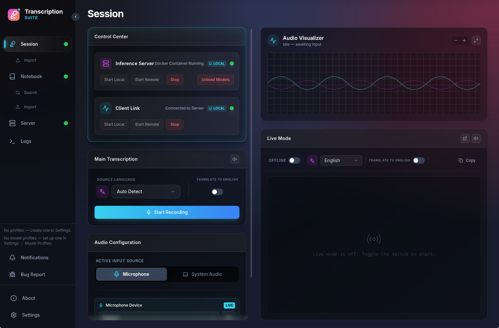
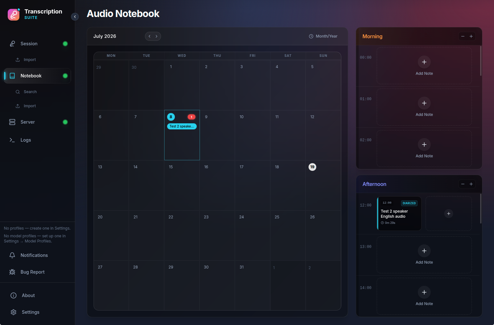
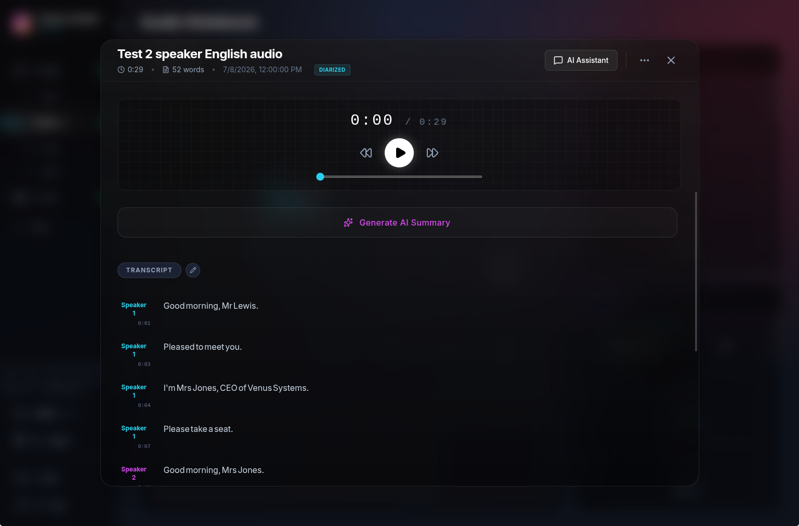
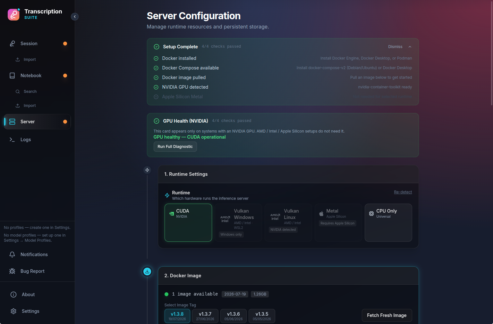
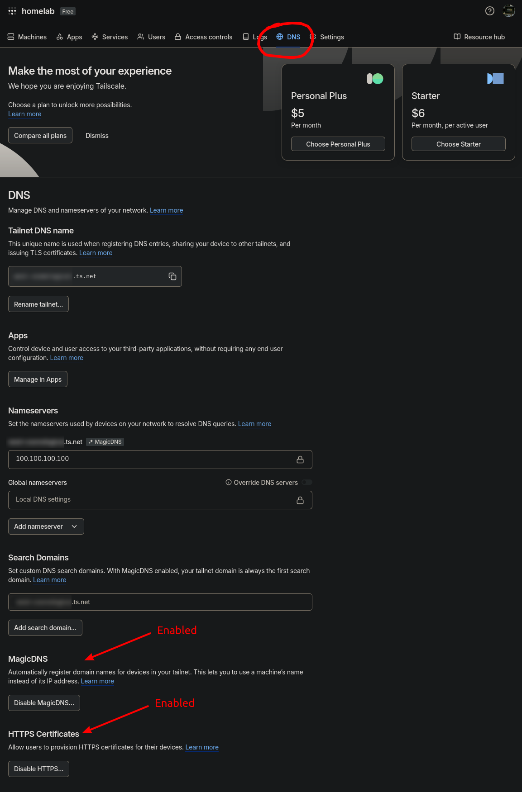

<p align="left">
  
</p>

<table width="100%">
  <tr>
    <td valign="top">
      <strong>Turn speech into text - on your own computer.</strong>
      <br><br>
      TranscriptionSuite is a free, open-source transcription app. Record a lecture,
      dictate a document, or import an audio file, and get an accurate transcript with
      speaker labels in minutes. Everything runs locally: your audio never leaves your
      machine.
      <br><br>
      Under the hood: an Electron dashboard + Python backend with multi-backend
      speech-to-text (Whisper, NVIDIA NeMo, VibeVoice-ASR, SenseVoice, whisper.cpp,
      MLX), accelerated by NVIDIA CUDA, Apple Metal, or AMD/Intel Vulkan - or plain
      CPU. Dockerized for fast setup.
    </td>
    <td align="left" valign="top" width="280px">
      <strong>OS Support:</strong><br>
      
      <br>
      <br>
      <strong>Hardware Acceleration:</strong><br>
      <br>
      <br>
      <br>
      
    </td>
  </tr>
</table>

<br>

<div align="center">

**Preview**


https://github.com/user-attachments/assets/f1ad13d3-fe5b-433b-b912-f13a83e2c240


</div>

## Table of Contents

- [1. Introduction](#1-introduction)
  - [1.1 Features](#11-features)
  - [1.2 Compatibility Matrix](#12-compatibility-matrix)
  - [1.3 Screenshots](#13-screenshots)
- [2. Installation](#2-installation)
  - [2.1 macOS Apple Silicon](#21-macos-apple-silicon)
  - [2.2 macOS Intel](#22-macos-intel)
  - [2.3 Windows](#23-windows)
  - [2.4 Linux](#24-linux)
  - [2.5 Download the Dashboard app](#25-download-the-dashboard-app)
    - [2.5.1 Linux AppImage Prerequisites](#251-linux-appimage-prerequisites)
    - [2.5.2 Verify Download with Kleopatra (optional)](#252-verify-download-with-kleopatra-optional)
  - [2.6 Setting Up the Server](#26-setting-up-the-server)
  - [2.7 AMD / Intel GPU Support (Vulkan)](#27-amd--intel-gpu-support-vulkan)
- [3. Remote Connection](#3-remote-connection)
  - [3.1 Option A: Tailscale (recommended)](#31-option-a-tailscale-recommended)
    - [Server Machine Setup](#server-machine-setup)
  - [3.2 Option B: LAN (same local network)](#32-option-b-lan-same-local-network)
- [4. OpenAI-compatible API Endpoints](#4-openai-compatible-api-endpoints)
- [5. Outgoing Webhooks](#5-outgoing-webhooks)
- [6. Troubleshooting](#6-troubleshooting)
- [7. Technical Info](#7-technical-info)
- [8. License](#8-license)
- [9. State of the Project](#9-state-of-the-project)
  - [9.1 In General & AI Disclosure](#91-in-general--ai-disclosure)
  - [9.2 Contributing](#92-contributing)

---

## 1. Introduction

TranscriptionSuite is two parts working as one app:

- the **Dashboard** - the desktop program you install, and
- the **server** - the transcription engine, which the Dashboard downloads and manages for you (in [Docker](https://www.docker.com/) on most platforms, natively on Apple Silicon Macs). Docker is a free program that runs the server in its own self-contained box; you install it once during setup and the Dashboard drives it for you.

Day-to-day use is entirely point-and-click; a terminal is only needed for a few one-time setup steps on some platforms. Want to get going right away? Jump to [Installation](#2-installation) and pick your platform. Wondering whether your computer can run it? Check the [Compatibility Matrix](#12-compatibility-matrix).

### 1.1 Features

- **100% local and private** - *everything* runs on your own computer. Internet is only needed to download the app and the model weights on first use*; after that it works fully offline. Your audio and transcripts never leave your machine.
- **Longform transcription** - record for as long as you want, from your microphone or the system audio, and get the full transcript seconds after you stop. While you record, a rolling preview shows the latest ~20 seconds of transcription so you can watch it work.
- **Live Mode** - real-time, sentence-by-sentence transcription for continuous dictation workflows. Runs on Whisper (faster-whisper) and whisper.cpp models; other model families don't serve Live Mode.
- **Speaker diarization** - automatic "who said what" labels for Whisper, NeMo, SenseVoice, and VibeVoice models. Whisper and NeMo use PyAnnote (needs a free HuggingFace account token; the app walks you through it during setup); SenseVoice ships a built-in CAM++ diarizer and VibeVoice diarizes by itself (no token for either). On Apple Silicon, [Sortformer](https://huggingface.co/mlx-community/diar_sortformer_4spk-v1-fp32) provides Metal-native diarization for up to 4 speakers, no token needed.
- **File import** - drop existing audio or video files into the Session tab and save the result as plain text (`.txt`), subtitles (`.srt`/`.ass`), or both, straight to a folder of your choice (no Notebook entry is created).
- **Your choice of speech models** - on the Docker platforms (Linux / Windows / Intel Mac): *WhisperX* ([faster-whisper](https://huggingface.co/Systran/faster-whisper-large-v3) models), NVIDIA NeMo [Parakeet v3](https://huggingface.co/nvidia/parakeet-tdt-0.6b-v3) / [Canary v2](https://huggingface.co/nvidia/canary-1b-v2), [VibeVoice-ASR](https://huggingface.co/microsoft/VibeVoice-ASR), [SenseVoice](https://huggingface.co/FunAudioLLM/SenseVoiceSmall) (FunASR), and [whisper.cpp](https://github.com/ggerganov/whisper.cpp) (GGML models, whisper.cpp's compact model format, for AMD/Intel GPUs via Vulkan; see [§2.7](#27-amd--intel-gpu-support-vulkan)). On Apple Silicon: [MLX Whisper](https://huggingface.co/mlx-community/whisper-large-v3-turbo-asr-fp16) (tiny → large-v3-turbo), [MLX Parakeet v3](https://huggingface.co/mlx-community/parakeet-tdt-0.6b-v3), [MLX Canary v2](https://huggingface.co/mlx-community/canary-1b-v2), and [MLX VibeVoice-ASR](https://huggingface.co/mlx-community/VibeVoice-ASR-bf16), all running natively on the GPU without Docker.
- **Truly multilingual** - Whisper transcribes [90+ languages](https://github.com/openai/whisper/blob/main/whisper/tokenizer.py) and can translate foreign audio to English; Canary v2 additionally translates in both directions across [25 European languages](https://huggingface.co/nvidia/canary-1b-v2); Parakeet covers 25 European languages; VibeVoice [51 languages](https://huggingface.co/microsoft/VibeVoice-ASR); SenseVoice 5 (Chinese, English, Cantonese, Japanese, Korean).
- **Parallel processing** - if your GPU has enough memory (VRAM), transcription and diarization run at the same time, cutting processing time significantly.
- **Audio Notebook** - every recording can be kept in a notebook with a calendar view, full-text search, and an AI assistant: chat about your notes with any OpenAI-compatible provider (LM Studio, Ollama, OpenAI, Groq, OpenRouter, and others).
- **Global keyboard shortcuts** - system-wide start/stop shortcuts and paste-at-cursor, so you can dictate into any app.
- **Remote access** - run the server on your desktop at home and transcribe from anywhere via [Tailscale](https://tailscale.com/), or share it on your local network via LAN ([§3](#3-remote-connection)).
- **Stays out of your way** - a **Notifications** entry at the bottom of the sidebar keeps a session log of downloads, server events, and errors (with toast popups for the important ones), and the app checks for new versions weekly so you don't have to.
- **Plays well with others** - an OpenAI-compatible API ([§4](#4-openai-compatible-api-endpoints)) lets tools like Open-WebUI and LM Studio use TranscriptionSuite as their transcription engine, and outgoing webhooks ([§5](#5-outgoing-webhooks)) push finished transcripts into your own automations.

📌*Half an hour of audio transcribed in under a minute with Whisper (RTX 3060)!*

\**What downloads on first use: the STT model weights themselves, plus the PyAnnote diarization and wav2vec2 alignment models if you use them. Everything is cached locally and nothing further is fetched after that.*

### 1.2 Compatibility Matrix

Not every model runs on every machine. **Not sure what any of this means? You can skip this section** - the app detects your hardware, pre-selects working defaults, and greys out incompatible choices with the reason shown.

A **runtime** is the engine mode the app uses to run the models, and it maps to your hardware: NVIDIA GPU = CUDA, Apple Silicon = Metal, AMD/Intel GPU = Vulkan, any machine = CPU. The tables below show which runtime fits your computer, and what each **model family** can do on it.

**Where each runtime runs** (runtime names as shown in the app):

| Runtime | Linux NVIDIA | Linux AMD/Intel | Windows NVIDIA | Windows AMD/Intel | macOS Apple Silicon | macOS Intel |
|---------|--------------|-----------------|----------------|-------------------|---------------------|-------------|
| **CUDA** (Docker) | Yes | No | Yes | No | No | No |
| **CPU Only** (Docker) | Yes | Yes | Yes | Yes | Yes¹ | Yes |
| **Vulkan Linux** (Docker + sidecar helper container) | No² | Yes | No | No | No | No |
| **Vulkan Windows** (Docker + native whisper-server) | No | No | No² | Yes | No | No |
| **Metal** (native, no Docker) | No | No | No | No | Yes | No |

> ¹ Possible, but Apple Silicon Macs should use Metal instead - it's native and much faster.
> ² When an NVIDIA GPU is detected, the app greys out the Vulkan runtimes ("NVIDIA detected" badge) and steers you to CUDA.

**Models × runtimes × features:**

| Model family | Runtime(s) | Live Mode | Translation | Diarization |
|--------------|------------|-----------|-------------|-------------|
| **Faster-Whisper** (WhisperX) | CUDA, CPU | Yes | To English (not turbo/`.en` variants) | PyAnnote (token) |
| **Parakeet v3** (NeMo) | CUDA | No | No | PyAnnote (token) |
| **Canary v2** (NeMo) | CUDA | No | Yes - bidirectional, 25 languages | PyAnnote (token) |
| **SenseVoice** (FunASR) | CUDA, CPU (slow) | No | No | CAM++ built-in (no token) or PyAnnote |
| **VibeVoice-ASR** | CUDA, CPU (very slow) | No | No | Built-in |
| **Whisper.cpp** (GGML) | Vulkan Linux/Windows | Yes | To English (not turbo/`.en` variants) | No |
| **MLX Whisper** | Metal | Via faster-whisper (CPU) | To English (not turbo/`.en` variants) | Sortformer (≤ 4 speakers) or PyAnnote |
| **MLX Parakeet v3** | Metal | Via faster-whisper (CPU) | No | Sortformer or PyAnnote |
| **MLX Canary v2** | Metal | Via faster-whisper (CPU) | No (MLX port) | Sortformer or PyAnnote |
| **MLX VibeVoice-ASR** | Metal | Via faster-whisper (CPU) | No | Built-in |

> **Notes:**
>
> - **Live Mode** always runs on faster-whisper or whisper.cpp models. On Apple Silicon the Metal server bundles faster-whisper for exactly this - Live Mode works, but decodes on the CPU rather than the GPU.
> - **PyAnnote** diarization needs a free HuggingFace token and accepting the [model's terms](https://huggingface.co/pyannote/speaker-diarization-community-1); the app asks for the token during first-start setup. **CAM++** (SenseVoice), **Sortformer** (Apple Silicon), and VibeVoice's **built-in** diarization need no token.
> - **Sortformer** handles up to 4 speakers; pick PyAnnote on Apple Silicon for larger groups.
> - NeMo models (Parakeet/Canary) are unavailable on the CPU runtime - the app substitutes a faster-whisper model instead.
> - NeMo models can't output the Greek final sigma (ς), so Greek word endings may be truncated; the app shows a warning when this applies.
> - **VibeVoice-ASR** is a 9-billion-parameter model (~16 GB download) - it wants a GPU with plenty of VRAM and is very slow on CPU.
> - Model weights that are missing get downloaded automatically when the server starts - there is no separate download step.
> - Older NVIDIA cards (GTX 10-series and earlier) use the same CUDA runtime with the **CUDA Legacy** image variant - see [§2.6](#26-setting-up-the-server).

### 1.3 Screenshots

<div align="center">

| Session Tab | Notebook Tab |
|:-----------:|:------------:|
|  |  |

| Audio Note View | Server Tab |
|:---------------:|:----------:|
|  |  |

</div>

---

## 2. Installation

The [Releases](https://github.com/homelab-00/TranscriptionSuite/releases) page contains the **Dashboard** only - the server is downloaded from inside the app. Pick the section for your platform:

| Your computer | Section | How the server runs |
|---|---|---|
| **Apple Silicon Mac (M1+)** | [§ 2.1](#21-macos-apple-silicon) | Natively on the Mac - no Docker |
| **Intel Mac (pre-M1)** | [§ 2.2](#22-macos-intel) | Docker / Podman (CPU only) |
| **Windows** | [§ 2.3](#23-windows) | Docker / Podman |
| **Linux** | [§ 2.4](#24-linux) | Docker / Podman |

---

### 2.1 macOS Apple Silicon

*For Macs with an Apple chip (M1 and later). This is the easiest setup: the server runs **natively on your Mac's GPU** - no Docker, no Python, no separate server install.*

Apple Silicon transcription runs on Apple's **Metal + MLX** GPU stack, bundled right inside the app. You download one file, drag it to Applications, and click **Start Metal Server**.

> *Naming note: wherever the app says "Metal server", what actually runs is **MLX** - Apple's machine-learning framework, which uses Metal as its GPU layer. MLX only exists on Apple Silicon, which is why Intel Macs ([§2.2](#22-macos-intel)) can't use this path.*

**Prerequisite - FFmpeg:** the server uses [FFmpeg](https://ffmpeg.org/) to decode compressed audio (M4A, MP3, FLAC, OGG - everything except WAV), and macOS doesn't ship it. Install it once with [Homebrew](https://brew.sh/):

```bash
brew install ffmpeg
```

Without it the server still starts, but importing anything other than a WAV file fails with a decode error. If you install FFmpeg while the app is running, restart the Metal server afterwards.

**Install steps:**

1. From the [Releases](https://github.com/homelab-00/TranscriptionSuite/releases) page, download **`TranscriptionSuite-<version>-arm64-mac-metal.dmg`** (~3-5 GB) - the **bundled** build with the dashboard **and** the Python/MLX server pre-installed. (Careful: there is also a thin `arm64-mac.dmg` without the server - see the tip below.)
2. Open the DMG and drag **TranscriptionSuite.app** into **Applications**.
3. The app is unsigned, so macOS will refuse to open it at first (as "unverified" or even "damaged"). Fix it either way:
   - **Terminal:** run once:
     ```bash
     xattr -dr com.apple.quarantine /Applications/TranscriptionSuite.app
     ```
   - **Or System Settings:** try to open the app, then go to **System Settings → Privacy & Security** and click **Open Anyway**.
4. Launch the app, open the **Server** tab, click the **Metal** tile in the **1. Runtime Settings** card, then click **Start Metal Server**. The first start downloads your selected model (a multi-GB download), so give it a few minutes - after that you're ready to transcribe.

> **Want to run the server somewhere else instead?** If you'd rather use this Mac only as a remote control for a server on another machine (e.g. a PC with an NVIDIA GPU), or run the server locally in Docker, download the **thin** `arm64-mac.dmg` (~200 MB, dashboard only) instead. Then set up a Docker server via [§2.5](#25-download-the-dashboard-app)-[§2.6](#26-setting-up-the-server), or connect to another machine via [§3 Remote Connection](#3-remote-connection).

---

### 2.2 macOS Intel

*For older Intel-based Macs (pre-M1). The server runs in **Docker on the CPU** - it works, but expect it to be slow. Intel Macs get no GPU acceleration here, because Apple's MLX is Apple-Silicon-only.*

1. **Install Docker.** Install [Docker Desktop for Mac](https://www.docker.com/products/docker-desktop/) (or [Podman Desktop](https://podman-desktop.io/)). The server will run in **CPU mode** - GPU acceleration isn't available through Docker on macOS.
2. **Download the thin dashboard and set up the server** using the shared sections below:
   - [§2.5 Download the Dashboard app](#25-download-the-dashboard-app) - use the `x64-mac.dmg` build
   - [§2.6 Setting Up the Server](#26-setting-up-the-server)

---

### 2.3 Windows

*Windows runs the server in Docker (or Podman). With an **NVIDIA** GPU you get full acceleration; with an **AMD or Intel** GPU use the Vulkan path ([§2.7](#27-amd--intel-gpu-support-vulkan)); otherwise the server runs on **CPU**.*

1. **Install Docker Desktop** with the **WSL 2** backend. During installation, if you're given the choice, tick **"Use WSL 2 instead of Hyper-V"**. You can confirm WSL 2 is active by running `wsl --list --verbose` in a terminal - the version column should read **2**.
2. **NVIDIA GPU:** install the NVIDIA GPU driver with WSL support (the standard NVIDIA gaming drivers work fine). Skip this if you'll run on CPU.
3. **AMD or Intel GPU:** see [§2.7 AMD / Intel GPU Support (Vulkan)](#27-amd--intel-gpu-support-vulkan) - the recommended route for these cards.
4. **Then continue with the shared steps:** [§2.5 Download the Dashboard app](#25-download-the-dashboard-app) and [§2.6 Setting Up the Server](#26-setting-up-the-server).

---

### 2.4 Linux

*Linux runs the server in Docker (or Podman). With an **NVIDIA** GPU you get full acceleration; with an **AMD or Intel** GPU use the Vulkan path ([§2.7](#27-amd--intel-gpu-support-vulkan)); otherwise the server runs on **CPU**.*

Pick **Docker** or **Podman** - the app auto-detects whichever is installed (Docker is checked first).

**Docker:**

1. Install Docker Engine.
    - Arch: `sudo pacman -S --needed docker`
    - Other distros: see the [Docker documentation](https://docs.docker.com/engine/install/).
2. Add your user to the `docker` group so the app can use Docker without `sudo`:
   ```bash
   sudo usermod -aG docker $USER
   ```
   Then **log out and back in** (or reboot) for it to take effect.
3. **NVIDIA GPU:** install the [NVIDIA Container Toolkit](https://docs.nvidia.com/datacenter/cloud-native/container-toolkit/install-guide.html), then wire it into Docker and restart the daemon:
   ```bash
   sudo nvidia-ctk runtime configure --runtime=docker
   sudo systemctl restart docker
   ```
   Skip this for CPU mode. (The app automatically prefers CDI when a CDI spec exists; if a later driver update breaks GPU access, see [GPU not working after a system update](#gpu-not-working-after-a-system-update-linux).)

**Podman** (4.7+ required for `podman compose`):

1. Install Podman.
    - Arch: `sudo pacman -S --needed podman`
    - Fedora/RHEL: pre-installed.
    - Other distros: see the [Podman documentation](https://podman.io/docs/installation).
2. Enable the Podman API socket (needed for compose operations):
   ```bash
   systemctl --user enable --now podman.socket
   ```
   Without it, compose commands fail with "Cannot connect to the Docker daemon" even though `podman` itself works.
3. **NVIDIA GPU:** install the [NVIDIA Container Toolkit](https://docs.nvidia.com/datacenter/cloud-native/container-toolkit/install-guide.html) (1.14+), then configure CDI by generating the device spec:
   ```bash
   sudo nvidia-ctk cdi generate --output=/etc/cdi/nvidia.yaml
   ```
   Skip this for CPU mode.

Then continue with the shared steps: [§2.5 Download the Dashboard app](#25-download-the-dashboard-app) and [§2.6 Setting Up the Server](#26-setting-up-the-server).

---

### 2.5 Download the Dashboard app

Download **and install** the Dashboard for your platform from the [Releases](https://github.com/homelab-00/TranscriptionSuite/releases) page. This is just the frontend - no models or packages are downloaded yet - but it must be installed before you set up the server in [§2.6](#26-setting-up-the-server).

**Which file to download:**

| Platform | File |
|---|---|
| **Linux** (x64) | `TranscriptionSuite-<version>.AppImage` |
| **Windows** (x64) | `TranscriptionSuite Setup <version>.exe` |
| **Mac - Apple Silicon, bundled server** | `TranscriptionSuite-<version>-arm64-mac-metal.dmg` ([§2.1](#21-macos-apple-silicon)) |
| **Mac - Apple Silicon, thin (dashboard only)** | `TranscriptionSuite-<version>-arm64-mac.dmg` |
| **Mac - Intel** | `TranscriptionSuite-<version>-x64-mac.dmg` ([§2.2](#22-macos-intel)) |

> *Only x64 builds exist for Linux and Windows - there are no ARM builds for those platforms. Each release file is signed with my GPG key (the matching `.asc` file); verifying is optional - see [§2.5.2](#252-verify-download-with-kleopatra-optional).*

> **macOS only:** after dragging the app into Applications, clear the "unverified app" quarantine once in Terminal:
> ```bash
> xattr -dr com.apple.quarantine /Applications/TranscriptionSuite.app
> ```

#### 2.5.1 Linux AppImage Prerequisites

AppImages need **FUSE 2** (`libfuse.so.2`), which isn't installed by default on some distros (Fedora and Arch KDE worked out of the box). If you see `dlopen(): error loading libfuse.so.2`, install the right package:

| Distribution | Package | Install Command |
|---|---|---|
| Ubuntu 22.04 / Debian | `libfuse2` | `sudo apt install libfuse2` |
| Ubuntu 24.04+ | `libfuse2t64` | `sudo apt install libfuse2t64` |
| Fedora | `fuse-libs` | `sudo dnf install fuse-libs` |
| Arch Linux | `fuse2` | `sudo pacman -S fuse2` |

> **Sandbox note:** The AppImage automatically disables Chromium's SUID sandbox (`--no-sandbox`), because the AppImage's squashfs mount can't satisfy its permission requirements. This is standard for Electron AppImages and doesn't affect security.

#### 2.5.2 Verify Download with Kleopatra (optional)

<details>
<summary><strong>Verification steps</strong></summary>

1. Download both files from the same release:
   - the installer/app (`.AppImage`, `.exe`, or `.dmg`)
   - the matching signature file (`.asc`)
2. Install Kleopatra: https://apps.kde.org/kleopatra/
3. Import my public key from this repository:
   - [`docs/assets/homelab-00_0xBFE4CC5D72020691_public.asc`](assets/homelab-00_0xBFE4CC5D72020691_public.asc)
4. In Kleopatra, use `File` → `Decrypt/Verify Files...` and select the downloaded `.asc` signature.
5. If prompted, select the matching app file. Verification should report a valid signature.

</details>

---

### 2.6 Setting Up the Server

*This section covers the Docker/Podman platforms - **Intel Mac, Windows, and Linux**. (Apple Silicon Macs already have the server bundled in the app - see [§2.1](#21-macos-apple-silicon).)*

The **Server** tab is laid out as a numbered wizard - just work through the cards from top to bottom:

> **Windows:** make sure Docker Desktop is **already running** before you start - server setup fails if it isn't.

1. **Pick your runtime** - in the **1. Runtime Settings** card, click a tile: **CUDA** (NVIDIA GPUs), **Vulkan Windows** / **Vulkan Linux** (AMD/Intel GPUs, [§2.7](#27-amd--intel-gpu-support-vulkan)), **Metal** (Apple Silicon), or **CPU Only** (any machine). Incompatible tiles are greyed out with the reason; on machines with an NVIDIA GPU the app disables the other GPU runtimes with an "NVIDIA detected" badge (CPU Only stays available).
2. **Fetch the image** - in the **2. Docker Image** card, click **Fetch Fresh Image**. The *Image Variant* row switches automatically to match your runtime; the only choice you'd ever make there yourself is **CUDA Legacy** for older NVIDIA cards (see below).
3. **Choose your models** - in the **3. Instance Settings** card, pick a **Main Transcriber**, a **Live Mode Model**, and a **Diarization** engine by clicking their cards. Badges show what's *Downloaded* or *Missing* - anything missing is downloaded automatically when the server starts. Invalid combinations are greyed out with the reason (see the [Compatibility Matrix](#12-compatibility-matrix)).
4. **Start it** - click **Start Local** at the bottom of the Instance Settings card. On the very first start the app walks you through a few quick prompts: confirming your model choices, approving the dependency download, and an **Optional Diarization Setup** step that asks for a HuggingFace token. The token is only needed for **PyAnnote** diarization - it's free ([create one here](https://huggingface.co/settings/tokens) with **Read** access) and you must also accept the [model's terms](https://huggingface.co/pyannote/speaker-diarization-community-1). Skipping this just disables PyAnnote; CAM++ and Sortformer need no token.
5. **Wait for green.** The first start downloads several GB and can take **10-20 minutes** on reasonable hardware - later starts are fast. The status light turning **green** means the server is running and healthy.
6. **Start the client** - go to the **Session** tab and click **Start Local** in the **Client Link** box. When it turns green, you're ready to roll!

<br>

**Notes:**

* *Settings are saved to:*
  * *Linux: `~/.config/TranscriptionSuite/`*
  * *Windows: `%APPDATA%\TranscriptionSuite\`*
  * *macOS: `~/Library/Application Support/TranscriptionSuite/`*
* *Model selection is locked while the server is running - stop it first to switch models.*
* *GNOME: the [AppIndicator](https://extensions.gnome.org/extension/615/appindicator-support/) extension is required for system-tray support.*
* *Docker vs Podman: both are supported and auto-detected (Docker first). If detection failed and you've since fixed the cause, use the **Retry** button in the Server tab's setup checklist. For GPU mode with Podman, make sure CDI is configured (`sudo nvidia-ctk cdi generate --output=/etc/cdi/nvidia.yaml`). Podman 4.7+ is required for `podman compose`.*

#### Older NVIDIA GPUs (GTX 10-series and earlier - Pascal / Maxwell)

The default Docker image ships PyTorch built for **Volta and newer** GPUs (RTX 20-series and up). On a Pascal- or Maxwell-generation card the container crash-loops with an error like *"NVIDIA GeForce GTX 1070 with CUDA capability sm_61 is not compatible with the current PyTorch installation"*.

<details>
<summary><strong>Affected cards</strong></summary>

- GeForce GTX 10-series - 1050 / 1060 / 1070 / 1080 (and Ti variants)
- GeForce GTX 900-series and GTX 750 / 750 Ti
- Tesla P4 / P40 / P100 / M40
- Quadro P-series and M-series

</details>

**Fix - switch to the CUDA Legacy image** (built from the same Dockerfile but pinned to the cu126 PyTorch wheels, which still support these cards):

1. In the **1. Runtime Settings** card, make sure the runtime is **CUDA**.
2. If the container already exists, stop the server and remove the container first.
3. In the **2. Docker Image** card, click the **CUDA Legacy** tile (*"GTX 10-series / 900-series and older"*) in the *Image Variant* row. Confirm the **"Switch to the CUDA Legacy image?"** dialog and leave **"Wipe runtime volume now (recommended)"** checked, so the next bootstrap re-syncs the cu126 wheels cleanly.
4. Click **Fetch Fresh Image** to pull the legacy image, then **Start Local**. The first start re-downloads PyTorch and dependencies (10-20 minutes); later starts are normal speed.

Once running, the legacy image behaves identically to the default. If you later move to a newer card, click the **CUDA / CPU Only** tile to switch back - staying on the legacy image with a modern GPU just gives you older PyTorch wheels for no benefit.

---

### 2.7 AMD / Intel GPU Support (Vulkan)

If you have an **AMD or Intel GPU** (instead of NVIDIA), you can get GPU-accelerated transcription with [whisper.cpp](https://github.com/ggerganov/whisper.cpp) and Vulkan. The setup differs per OS:

- **Windows** - the app runs a native `whisper-server.exe` on your PC and manages it for you. See [§2.7.1](#271-windows).
- **Linux** - a helper Docker container (sidecar) runs alongside the main one. See [§2.7.2](#272-linux).

Either way, you use **GGML models** (not the CUDA models) - see the [model table below](#available-ggml-models). Diarization is not available for GGML models. Note that on machines with an NVIDIA GPU, the app disables both Vulkan runtimes ("NVIDIA detected") and steers you to CUDA.

#### 2.7.1 Windows

**What you need:**

- An AMD or Intel GPU with current Windows drivers
- Docker Desktop with the **WSL 2 backend** enabled (Settings → General → "Use the WSL 2 based engine") - without WSL 2 GPU passthrough the runtime tile is disabled with *"Requires WSL2 GPU"*

**How it works:** the app downloads a native `whisper-server.exe`, runs it directly on Windows (not inside Docker), and the Docker backend talks to it at `http://host.docker.internal:8080`. Running it natively avoids the AVX2 CPU requirement of the containerized Vulkan build, so it works on a wider range of CPUs. Docker Desktop is still needed for the main backend container - only the whisper engine runs natively.

**How to set it up:**

1. In the **Server** tab's **1. Runtime Settings** card, click the **Vulkan Windows** tile. (It's marked *Experimental* in the app, but for AMD/Intel GPUs on Windows it's the recommended GPU path.)
2. In the **2. Docker Image** card, the *Image Variant* switches to Vulkan Windows automatically - this profile uses its own dedicated image. Click **Fetch Fresh Image** and wait for the download to finish.
3. In the **3. Instance Settings** card, select **Whisper.cpp** as your **Main Transcriber** and pick a **GGML model** from the row below it; optionally do the same for **Live Mode**. (Diarization isn't offered for GGML models - the selector says so itself.)
4. Click **Start Local**. The app downloads `whisper-server.exe` automatically if it isn't already present, then starts the Docker backend; missing GGML weights download during startup.
5. Wait for the server status to turn green. You're ready to transcribe.

> **Where the file lives:** `whisper-server.exe` is stored at `%APPDATA%\TranscriptionSuite\whisper-server\whisper-server.exe` and managed automatically by the app. You don't need to install or configure it yourself.

#### 2.7.2 Linux

**What you need:**

- An AMD GPU with Vulkan support (RDNA1 or newer - e.g. RX 5500 XT, RX 6600, RX 7800 XT), **or** an Intel GPU with Vulkan support (Arc A-series or integrated Xe graphics)
- Docker installed (Podman isn't supported for Vulkan mode yet)
- A Linux host with `/dev/dri/renderD128` (a real DRI render node from the AMD/Intel kernel driver)

**How to set it up:**

1. In the **1. Runtime Settings** card, click the **Vulkan Linux** tile.
2. In the **2. Docker Image** card, the *Image Variant* switches to Vulkan Linux automatically - this profile uses its own dedicated image. Click **Fetch Fresh Image** and wait for the download to finish.
3. In the **3. Instance Settings** card, under **Main Transcriber** select **Whisper.cpp**, then pick the GGML model you want from the row below it - e.g. `ggml-large-v3-turbo-q8_0.bin` (see the [model table below](#available-ggml-models)).
4. Under **Live Mode Model**, select **Whisper.cpp** again and pick a GGML model. **Use the same model for Main and Live Mode** - mixing different GGML models currently has issues we're still working on. (The "Same as main" shortcut isn't available for GGML models, so pick the same model manually in both selectors.)
5. Click **Start Local**. Missing GGML weights download during startup; diarization isn't offered for GGML models.

> **Switching models:** model selection is locked while the server is running. To switch, stop the server, pick the new model, then start again.

#### Available GGML models

**Recommended:** `ggml-large-v3-turbo-q8_0.bin` (~1.4 GB) - best balance of speed, quality, and VRAM use for most AMD/Intel GPUs.

<details>
<summary><strong>Full model table</strong></summary>

| Model | Size | Languages | Translation | Notes |
|-------|------|-----------|-------------|-------|
| `ggml-large-v3.bin` | ~3.1 GB | 99 | Yes | Highest accuracy |
| `ggml-large-v3-q5_0.bin` | ~2.1 GB | 99 | Yes | Good accuracy, lower VRAM |
| `ggml-large-v3-turbo.bin` | ~1.6 GB | 99 | No | Fast, no translation |
| `ggml-large-v3-turbo-q5_0.bin` | ~1.1 GB | 99 | No | Compact, fast |
| **`ggml-large-v3-turbo-q8_0.bin`** | **~1.4 GB** | **99** | **No** | **Recommended** |
| `ggml-medium.bin` | ~1.5 GB | 99 | Yes | Good multilingual option |
| `ggml-medium-q5_0.bin` | ~1.0 GB | 99 | Yes | Compact multilingual |
| `ggml-medium.en.bin` | ~1.5 GB | English | No | English-only |
| `ggml-small.bin` | ~465 MB | 99 | Yes | Lightweight |
| `ggml-small-q5_1.bin` | ~370 MB | 99 | Yes | Smallest multilingual |
| `ggml-small.en.bin` | ~465 MB | English | No | Smallest English-only |

Translation (to English) is available on the non-turbo, non-`.en` models. GGML weights download over HTTPS from [huggingface.co/ggerganov/whisper.cpp](https://huggingface.co/ggerganov/whisper.cpp).

</details>

#### Vulkan troubleshooting

- **_A model is greyed out with a "Requires CUDA" badge_** - you're on a Vulkan runtime; use a GGML model instead (the CUDA models won't run through whisper.cpp).
- **_Sidecar health-check timeout_** - the model is still loading; large GGML files can take 30-60 seconds to initialize on first start.
- **_Older AMD GPUs (RDNA1):_** if you hit Vulkan initialization errors on an RX 5500 XT or similar RDNA1 card, try adding `iommu=soft` to your kernel boot parameters.
- **_Windows feels slow?_** Make sure Docker Desktop is using the WSL 2 backend (Settings → General → "Use the WSL 2 based engine").

---

## 3. Remote Connection

TranscriptionSuite supports remote transcription: a **server machine** (with a GPU) runs the container, and a **client machine** connects to it through the Dashboard app. Two connection profiles are available:

| Profile | Use Case | Network Requirement |
|---------|----------|---------------------|
| **Tailscale** | Cross-network / internet (recommended) | Both machines on the same [Tailnet](https://tailscale.com/) |
| **LAN** | Same local network, no Tailscale needed | Both machines on the same LAN / subnet |

Both profiles use **HTTPS + token authentication** on port **9786**. The only difference is *how* the client reaches the server and *where* the TLS certificates come from.

> **Remote profile chooser:** the first time you click **Start Remote** without Tailscale certificates configured, a dialog asks you to choose between **LAN** and **Tailscale**. Pick **LAN** if both machines are on the same local network - no extra setup is needed (a self-signed certificate is generated automatically). Pick **Tailscale** for cross-network access. You can change this later in **Settings → Client → Remote Profile**.

```
┌─────────────────────────┐         HTTPS (port 9786)        ┌─────────────────────────┐
│      Server Machine     │◄────────────────────────────────►│      Client Machine     │
│                         │         + Auth Token             │                         │
│  • Runs the Dashboard   │                                  │  • Runs the Dashboard   │
│  • Clicks "Start Remote"│         Tailscale Tunnel         │  • Settings → Client →  │
│  • Has TLS certificates │         ── or ──                 │    "Use remote server"  │
│  • Has the GPU          │         LAN connection           │  • No GPU needed        │
└─────────────────────────┘                                  └─────────────────────────┘
```

**Security model:** Tailscale-profile traffic is reachable only from devices on your Tailnet; all traffic is TLS-encrypted; and every API request in remote mode requires a Bearer token. The Settings → Client tab also has a **Manage Tokens** panel to mint extra per-client tokens and revoke old ones.

### 3.1 Option A: Tailscale (recommended)

Use this when the server and client are on **different networks** (e.g., home server ↔ work laptop), or when you want Tailscale's zero-config networking and automatic DNS.

#### Server Machine Setup

**Step 1 - Install & Authenticate Tailscale**

1. Install Tailscale: [tailscale.com/download](https://tailscale.com/download)
2. Authenticate: `sudo tailscale up` (Linux) or via the Tailscale app (Windows/macOS)
3. Go to the [Tailscale Admin Console](https://login.tailscale.com/admin) → **DNS** tab
4. Enable **MagicDNS** and **HTTPS Certificates**

Your DNS settings should look like this:



**Step 2 - Generate TLS Certificates** *(server machine only)*

```bash
# Replace with your actual machine name + tailnet
sudo tailscale cert your-machine.your-tailnet.ts.net
```

This produces a `.crt` and a `.key` file. Move and rename them to the standard location so the app finds them without config changes *(to change the location, edit `remote_server.tls.host_cert_path` / `host_key_path` in `config.yaml`)*:

**Linux:**
```bash
mkdir -p ~/.config/Tailscale
mv your-machine.your-tailnet.ts.net.crt ~/.config/Tailscale/my-machine.crt
mv your-machine.your-tailnet.ts.net.key ~/.config/Tailscale/my-machine.key
sudo chown $USER:$USER ~/.config/Tailscale/my-machine.*
chmod 600 ~/.config/Tailscale/my-machine.key
```

**Windows (PowerShell):**
```powershell
mkdir "$env:USERPROFILE\Documents\Tailscale" -Force
mv your-machine.your-tailnet.ts.net.crt "$env:USERPROFILE\Documents\Tailscale\my-machine.crt"
mv your-machine.your-tailnet.ts.net.key "$env:USERPROFILE\Documents\Tailscale\my-machine.key"
```

For Windows, also update the certificate paths in `config.yaml`:
```yaml
remote_server:
  tls:
    host_cert_path: "~/Documents/Tailscale/my-machine.crt"
    host_key_path: "~/Documents/Tailscale/my-machine.key"
```

> **Note:** Tailscale HTTPS certificates are issued for `.ts.net` hostnames, so MagicDNS must be enabled in your Tailnet.
>
> **Certificate expiry:** these certificates expire after **90 days**. The app attempts to auto-renew via `tailscale cert` before starting the server; if that fails, re-run the `tailscale cert` + `mv` commands above.

**Step 3 - Start the Server in Remote Mode**

1. Open the Dashboard on the server machine, go to the **Server** tab, and click **Start Remote**.
2. Wait for the container to become healthy (green status).
3. On the first remote start an admin **auth token** is generated automatically. Copy it from the Server tab's "Auth Token" field (or from the container logs: `docker compose logs | grep "Admin Token:"`) - you'll need it on the client machine.

> **Tailscale hostname:** once the server is running, the Server tab displays the machine's full Tailscale FQDN (e.g., `desktop.tail1234.ts.net`) with a copy button. Use this exact hostname when configuring clients - not just the tailnet suffix.

**Step 4 - Open the Firewall Port (Linux)**

If the server machine runs a firewall, port 9786 must be open or connections will silently time out. The dashboard shows a warning banner on the Server tab if it detects the port may be blocked.

| Distribution | Command |
|---|---|
| **Ubuntu / Debian** (`ufw`) | `sudo ufw allow 9786/tcp comment 'TranscriptionSuite Server'` |
| **Fedora** (`firewalld`) | `sudo firewall-cmd --permanent --add-port=9786/tcp && sudo firewall-cmd --reload` |

#### Client Machine Setup

1. Install Tailscale on the client machine and sign in with the **same account** as the server machine (so both devices are on the same Tailnet).
2. Open the Dashboard, go to **Settings → Client**, and enable **"Use remote server instead of local"**.
3. Select **Tailscale** as the remote profile.
4. Enter the server's **full Tailscale hostname** (e.g., `my-machine.tail1234.ts.net`) - copy it from the Server tab on the server machine. The Settings modal warns you if you enter a bare tailnet name without the machine prefix.
5. Set port to **`9786`** (**Use HTTPS** enables automatically).
6. Paste the **auth token** from the server, then close Settings - the client now connects to the remote server.

> **Tip:** the client machine does *not* need certificates, Docker, or a GPU. It only needs Tailscale running and a valid auth token.

### 3.2 Option B: LAN (same local network)

Use this when both machines are on the **same local network** and you don't want Tailscale - common for home-lab or office setups. LAN mode uses the same HTTPS + token authentication; only the hostname (a LAN IP instead of a `.ts.net` address) and the certificate source differ.

#### Server Machine Setup

1. **TLS certificate:** the dashboard **auto-generates** a self-signed certificate on the first remote start if none exists, covering `localhost` and all detected LAN IPs. No manual steps are needed in most cases.
   - Certificate generation uses the `openssl` command-line tool, which is preinstalled on Linux and macOS. On **Windows**, `openssl.exe` is usually *not* on PATH - if generation fails, install OpenSSL for Windows, make sure `openssl.exe` is on your PATH, and try again.
   - *Custom certificate (optional):* to use your own (e.g. from an internal CA), place it at the paths in `config.yaml` under `remote_server.tls.lan_host_cert_path` / `lan_host_key_path` (defaults: `~/.config/TranscriptionSuite/lan-server.crt` / `.key` on Linux, `~/Documents/TranscriptionSuite/lan-server.crt` / `.key` on Windows).
2. **Start Remote:** open the **Server** tab, click **Start Remote**, and copy the auth token once the container is healthy (same as Tailscale above).
3. **Firewall (Linux):** if a firewall is active, open port 9786: `sudo ufw allow 9786/tcp` (Ubuntu/Debian) or `sudo firewall-cmd --permanent --add-port=9786/tcp && sudo firewall-cmd --reload` (Fedora).

#### Client Machine Setup

Same as the Tailscale client setup, except: select **LAN** as the remote profile and enter the server's **LAN IP or hostname** (e.g., `192.168.1.100`) as the host.

> **Note on Kubernetes / custom deployments:** if you run the server container directly (e.g., via Kubernetes or your own Docker setup), you can still use the LAN profile on the client - point the LAN host at your load balancer or service IP. The server image is at `ghcr.io/homelab-00/transcriptionsuite-server`. Ensure `TLS_ENABLED=true` and mount the certificate/key at `/certs/cert.crt` and `/certs/cert.key` inside the container.

---

## 4. OpenAI-compatible API Endpoints

*This is a summary - for more detail see [README_DEV](README_DEV.md).*

Mounted at `/v1/audio/`. These endpoints follow the [OpenAI Audio API spec](https://platform.openai.com/docs/api-reference/audio) so that OpenAI-compatible clients (Open-WebUI, LM Studio, etc.) can point at TranscriptionSuite as a drop-in STT backend.

**Auth:** same rules as all other API routes - Bearer token required in TLS mode; open to localhost in local mode.

**Error shape:** errors follow the OpenAI error envelope:
```json
{"error": {"message": "...", "type": "...", "param": null, "code": null}}
```

#### `POST /v1/audio/transcriptions`

Transcribe an audio or video file. Language auto-detected when `language` is omitted.

<details>
<summary><strong>Form fields</strong></summary>

| Field | Type | Default | Description |
|-------|------|---------|-------------|
| `file` | `UploadFile` | required | Audio or video file |
| `model` | `string` | `"whisper-1"` | Accepted but ignored; the server uses whatever model is configured |
| `language` | `string` | auto-detect | BCP-47 language code (e.g. `en`, `fr`) |
| `prompt` | `string` | `null` | Initial prompt passed to the transcription engine as `initial_prompt` |
| `response_format` | `string` | `"json"` | One of `json`, `text`, `verbose_json`, `srt`, `vtt`, `diarized_json` |
| `temperature` | `float` | `null` | Accepted but ignored |
| `timestamp_granularities[]` | `list[string]` | `null` | Include `"word"` to enable word-level timestamps (effective with `verbose_json` / `diarized_json`) |
| `diarization` | `bool` | `false` | When `true`, run speaker diarization and attach speaker labels to segments |
| `expected_speakers` | `int (1-10)` | `null` | Exact speaker count hint; out-of-range values return `400` |
| `parallel_diarization` | `bool` | server config | Override parallel vs sequential diarize + transcribe for this call |

</details>

**Response formats:**

| `response_format` | Content-Type | Shape |
|-------------------|--------------|-------|
| `json` | `application/json` | `{"text": "..."}` - minimal OpenAI body; never leaks speaker labels |
| `text` | `text/plain` | Raw transcript string |
| `verbose_json` | `application/json` | Full OpenAI object (`task`, `language`, `duration`, `text`, `segments`, optional `words`); gains per-segment `speaker` and top-level `num_speakers` when diarization ran |
| `srt` | `text/plain` | SRT subtitle file; cues prefixed `Speaker 1:`, `Speaker 2:` when diarization ran |
| `vtt` | `text/plain` | WebVTT subtitle file; same speaker prefix as SRT |
| `diarized_json` | `application/json` | Compact `{task, language, duration, text, num_speakers, segments}` with `speaker`, `start`, `end`, `text` per segment (raw `SPEAKER_00` form for programmatic use) |

**Speaker labels:** JSON bodies (`verbose_json`, `diarized_json`) use raw `SPEAKER_00`/`SPEAKER_01` form for stable programmatic identifiers. Subtitle formats (`srt`, `vtt`) normalize to `Speaker 1`/`Speaker 2` - the same convention the dashboard's longform export uses.

**Diarization failure tolerance:** if `diarization=true` is requested but the diarization engine fails (no HF token, OOM, merge error), the endpoint returns 200 with a plain transcript (`num_speakers=0`, no `speaker` keys) and logs a WARNING server-side. Diarization hiccups never 5xx the call. Whenever diarization was requested, the response carries an `X-Diarization-Status` header (`ready` or `unavailable`) so clients can detect this.

**Error codes:**

| Status | `type` | Cause |
|--------|--------|-------|
| `400` | `invalid_request_error` | Unknown `response_format`, empty `file` field, `expected_speakers` out of 1-10 |
| `429` | `rate_limit_error` | Another transcription job is already running - the job slot is shared with the dashboard, so a longform, import, or notebook job in progress also triggers this (Live Mode uses a separate path and doesn't occupy the slot) |
| `503` | `server_error` | No transcription model configured, or a backend dependency is unavailable |
| `500` | `server_error` | Internal engine error, or the job was cancelled |

> A completely *missing* `file` field is rejected by FastAPI's own validation as a `422` with a different (non-OpenAI) error shape.

<details>
<summary><strong>curl examples</strong></summary>

Diarized verbose transcript:
```bash
curl -X POST http://localhost:9786/v1/audio/transcriptions \
  -H "Authorization: Bearer <token>" \
  -F "file=@recording.wav" \
  -F "diarization=true" \
  -F "expected_speakers=2" \
  -F "response_format=diarized_json"
```

Word-level verbose:
```bash
curl -X POST http://localhost:9786/v1/audio/transcriptions \
  -H "Authorization: Bearer <token>" \
  -F "file=@recording.wav" \
  -F "response_format=verbose_json" \
  -F "timestamp_granularities[]=word"
```

</details>

#### `POST /v1/audio/translations`

Transcribe **and translate** an audio or video file to English. Identical to `/transcriptions` (same fields, formats, and error codes) except:
- `language` is not accepted (source language is always auto-detected)
- Translation target is always English
- The `task` field in `verbose_json` responses is `"translate"` instead of `"transcribe"`

> **Backend note:** translation requires a model with translation capability - a multilingual Whisper model (to English) or Canary v2 (bidirectional). Backends without translation support (Parakeet, SenseVoice, VibeVoice, turbo/`.en` Whisper variants) return a `400` or `500` from the engine layer.

<details>
<summary><strong>curl examples</strong></summary>

```bash
curl -X POST http://localhost:9786/v1/audio/translations \
  -H "Authorization: Bearer <token>" \
  -F "file=@foreign_audio.mp3" \
  -F "response_format=text"
```

Diarized translation:
```bash
curl -X POST http://localhost:9786/v1/audio/translations \
  -H "Authorization: Bearer <token>" \
  -F "file=@foreign_audio.mp3" \
  -F "diarization=true" \
  -F "response_format=diarized_json"
```

</details>

---

## 5. Outgoing Webhooks

TranscriptionSuite can send HTTP POST requests to an external URL whenever a transcription event occurs, so you can pipe results into your own applications, automation pipelines, or logging services.

| Event | Fires when |
|-------|------------|
| `live_sentence` | A sentence is completed during Live Mode |
| `longform_complete` | A transcription job finishes (file, import, notebook, or OpenAI-API job) |

### Setup

Open **Settings → Server** tab. In the **Outgoing Webhook** section:

1. **Enable** the webhook toggle
2. Enter the **URL** to receive POST requests
3. *(Optional)* Enter a **Secret** - sent as `Authorization: Bearer <secret>` on every request
4. Save the server config (webhook fields are applied with the save button, not instantly), then click **Send Test Webhook** to verify your endpoint receives the request

These settings are also editable directly in `config.yaml`:

```yaml
webhook:
    enabled: true
    url: "https://your-api.example.com/webhook"
    secret: "your-optional-secret"
```

### Payload Format

Every webhook POST has `Content-Type: application/json` with this envelope:

```json
{
  "event": "live_sentence",
  "timestamp": "2026-03-24T14:30:00.123456+00:00",
  "payload": { ... }
}
```

<details>
<summary><strong>Payload shapes per event</strong></summary>

**Live sentence:**

```json
{
  "source": "live",
  "text": "The completed sentence."
}
```

**Longform completion:**

```json
{
  "source": "longform",
  "text": "Full transcript text...",
  "filename": "meeting.wav",
  "duration": 1234.56,
  "language": "en",
  "num_speakers": 2
}
```

**Test webhook** (from the Send Test Webhook button): `{"event": "test", ..., "payload": {"message": "Test webhook from TranscriptionSuite.", "source": "test"}}`

</details>

**Delivery notes:**

- Delivery is fire-and-forget: each webhook is sent once with a **10-second timeout** and is not retried on failure. Failed deliveries are logged server-side.
- For safety, URLs pointing at private or internal addresses (localhost, LAN IPs, `.local`/`.internal` hostnames, non-http(s) schemes) are **blocked** - the test button reports *"URL blocked: targets a private or internal address"*. Use a publicly resolvable endpoint.

---

## 6. Troubleshooting

As with most things, the first thing to try is turning it off and on again: stop the server/client, quit the app, and try again.

The next step is deleting things and letting the app re-fetch them. All the controls are in the **Server** tab:

- **Remove Image** - in the *2. Docker Image* card
- **Remove Container** - in the *3. Instance Settings* card
- **Clear Data** / **Clear Models** / **Clear Runtime** - per-volume buttons in the *5. Persistent Volumes* card
- **Clean All** - the big red button in the *6. Clean Up* card. Its dialog has checkboxes to keep the data volume, the models volume, and the config folder; everything unchecked means a full wipe.

What the volumes hold: **data** is your database and Notebook recordings (the irreplaceable one - back it up before clearing!), **models** is downloaded model weights (safe to clear, they re-download), and **runtime** is scratch space (always safe to clear; Clean All always wipes it). On Apple Silicon (Metal) there are no Docker volumes - the Persistent Volumes card lists the local directories instead.

Server logs live in the **Logs** tab in the sidebar - the first place to look when something misbehaves.

### GPU not working after a system update (Linux)

If the server crashes with `CUDA failed with error unknown error` after a system update (common on rolling-release distros like Arch), your NVIDIA driver likely updated past what the legacy Docker GPU hook supports. Switch to CDI mode:

```bash
sudo nvidia-ctk cdi generate --output=/etc/cdi/nvidia.yaml
sudo nvidia-ctk config --in-place --set nvidia-container-runtime.mode=cdi
sudo systemctl restart docker
```

The dashboard detects CDI automatically and uses the correct GPU configuration - no image rebuild or reinstall needed. Note that the CDI spec describes your current driver, so re-run the `cdi generate` command after future driver updates too (the dashboard warns when the spec looks stale).

### Dashboard shows GPU error / red status

**Symptom:** the dashboard shows a red error state with "GPU unavailable" in the Session tab.

**Steps:**

1. **Restart your computer** to fully reset the GPU driver state. This resolves most cases of CUDA error 999 (driver context poisoning from a prior crash).
2. If the error recurs frequently, enable NVIDIA Persistence Mode on the host to prevent the driver from entering a degraded state on container stop/start cycles:
   ```bash
   sudo nvidia-smi -pm 1
   ```
3. If the error persists after a reboot, check the **Logs** tab for the CUDA diagnostic line (logged at startup). It contains the torch version, CUDA version, and device nodes - useful for reporting the issue.
4. **Advanced:** `sudo nvidia-smi --gpu-reset` can reset the GPU without a full reboot, but this affects all processes using the GPU on the host.
5. **Workaround:** switch to the **CPU Only** runtime in the Server tab while you investigate (expect slower transcription).

### GPU errors persist across container restarts

**Symptom:** `nvidia-smi` shows a healthy GPU, but the server logs report CUDA error 999 every time the container starts.

**Cause:** the NVIDIA driver can enter a degraded context when a container exits uncleanly. Without Persistence Mode, the driver resets incompletely on the next attach.

**Solution:** enable NVIDIA Persistence Mode on the host:

```bash
sudo nvidia-smi -pm 1
```

This persists until the next reboot. To make it permanent, install the included systemd unit (run from the repo root):

```bash
sudo cp build/nvidia-persistence.service /etc/systemd/system/
sudo systemctl daemon-reload
sudo systemctl enable --now nvidia-persistence.service
```

### Windows / CPU-only: local start fails

**Symptom:** on a CPU-only machine (no NVIDIA GPU), first start fails during dependency install - either with `invalid peer certificate: UnknownIssuer` while downloading packages, or later with `UnicodeEncodeError: 'latin-1' codec can't encode ...` when loading the model.

**Steps:**

1. **Use the CPU runtime.** In the Server tab's Runtime Settings, select **CPU Only** before starting. CPU-only hosts then skip the multi-GB NVIDIA CUDA wheels and default to a lighter faster-whisper model.
2. **`UnknownIssuer` / certificate errors** mean something (antivirus HTTPS scanning, or a corporate proxy) is intercepting HTTPS and re-signing it, so the container can't verify the package index. Turn off your antivirus's HTTPS-scanning setting, or point `EXTRA_CA_CERTS_DIR` at a folder holding the intercepting root CA - see the [deployment guide](deployment-guide.md#tls-interception--corporate-network-unknownissuer).
3. **`UnicodeEncodeError` on model load** means a HuggingFace token containing a non-ASCII character was provided. Clear the token (most models don't need one); the server also ignores non-ASCII tokens automatically and downloads anonymously.

### Advanced Troubleshooting

For more advanced troubleshooting steps, head over to README_DEV's [Troubleshooting section](README_DEV.md#13-troubleshooting).

---

## 7. Technical Info

For more information about the technical aspects of the project, check out [README_DEV](README_DEV.md).

---

## 8. License

GNU General Public License v3.0 or later (GPLv3+) - See [LICENSE](../LICENSE).

---

## 9. State of the Project

### 9.1 In General & AI Disclosure

This was initially developed as a personal tool and in time turned into a hobby project. I am an engineer, just not a *software* engineer; so **this whole thing is vibecoded**. At the same time it's not blind vibecoding; for example Dockerizing the server for easy distribution was 100% my idea.

I'm using this project to learn about programming. Starting from virtually nothing, I can now say that I've got a decent grasp of Python, git, uv & Docker. I started doing this because it's fun, not to make money. Though I do find, despite my mech eng degree, that I want to follow it as a career.

Anyways, since I'm 100% dogfooding the app I'm not going to abandon it (unless some other project makes mine completely redundant). I will also try to the best of my ability to deal with bugs as soon as possible.

Finally, I want to thank [RealtimeSTT](https://github.com/KoljaB/RealtimeSTT) for inspiring this project.

### 9.2 Contributing

I'm always open to contributors! Might help me learn a thing or two about programming. 

To follow the progress of issues and planned features, head over to the project's [Blackboard](https://github.com/users/homelab-00/projects/2/views/2). Pick a planned feature to work on or add your own suggestion.
